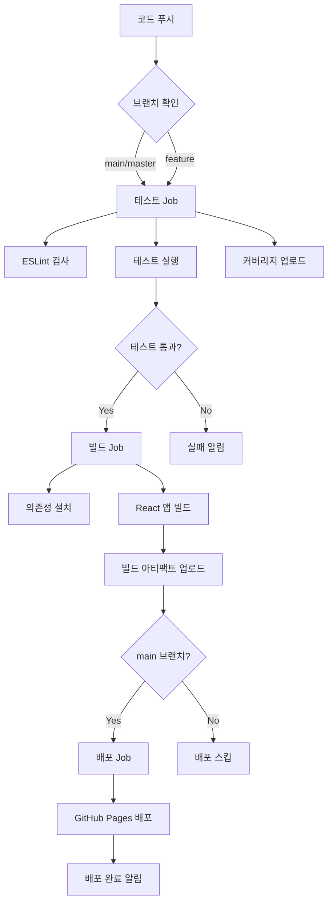

# 🚀 GitHub Actions CI/CD 완전 가이드

## 📋 개요

이 프로젝트는 GitHub Actions를 사용한 완전한 CI/CD (Continuous Integration/Continuous Deployment) 파이프라인을 구축했습니다.

## 🎯 CI/CD 파이프라인 구성

### 🔄 워크플로우 개요

| 워크플로우 | 트리거 | 용도 | 상태 |
|------------|--------|------|------|
| `deploy-gh-pages.yml` | Push to main, PR | 메인 CI/CD 파이프라인 | ✅ 활성 |
| `deploy-json-server.yml` | Backend 파일 변경 | 백엔드 API 배포 | ✅ 활성 |
| `pr-check.yml` | Pull Request | 코드 품질 검사 | ✅ 활성 |
| `maintenance.yml` | 주간 스케줄 | 자동 유지보수 | ✅ 활성 |

### 🏗️ 메인 CI/CD 파이프라인 (`deploy-gh-pages.yml`)



## 🛠️ 로컬 개발 환경 설정

### 1. 코드 품질 도구 설정

```cmd
REM Git hooks 설정 (Windows)
setup-githooks.bat

REM 수동으로 코드 품질 검사
npm run lint              # ESLint 검사
npm run lint:fix          # ESLint 자동 수정
npm run format            # Prettier 포맷팅
npm run format:check      # 포맷 검사만
npm run ci:test           # CI용 테스트 실행
npm run ci:build          # 전체 CI 파이프라인 로컬 실행
```

### 2. 개발 워크플로우

1. **브랜치 생성**
   ```cmd
   git checkout -b feature/새기능
   ```

2. **개발 및 테스트**
   ```cmd
   npm start                # 개발 서버 시작
   npm run database         # JSON Server 시작 (별도 터미널)
   npm run ci:build         # 로컬 CI 테스트
   ```

3. **코드 커밋** (자동 품질 검사 실행)
   ```cmd
   git add .
   git commit -m "feat: 새 기능 추가"
   ```

4. **Pull Request 생성**
   - GitHub에서 PR 생성시 자동으로 코드 품질 검사 실행
   - 모든 검사 통과후 리뷰 진행

5. **메인 브랜치 병합**
   - 자동으로 배포 파이프라인 실행
   - GitHub Pages에 자동 배포

## 🔧 배포 환경 설정

### GitHub Pages (Frontend)

1. **Repository Settings**
   - Settings > Pages
   - Source: "GitHub Actions" 선택

2. **package.json 설정**
   ```json
   {
     "homepage": "https://[username].github.io/[repository-name]"
   }
   ```

### Vercel (Backend API)

1. **Secrets 설정**
   ```
   VERCEL_TOKEN=your_vercel_token
   VERCEL_ORG_ID=your_org_id
   VERCEL_PROJECT_ID=your_project_id
   ```

2. **Vercel 프로젝트 설정**
   - Root Directory: `deploy`
   - Build Command: `npm install && npm start`

### Railway (Backend API 대안)

1. **Secrets 설정**
   ```
   RAILWAY_TOKEN=your_railway_token
   RAILWAY_SERVICE_ID=your_service_id
   ```

## 📊 CI/CD 모니터링

### GitHub Actions 탭에서 확인할 수 있는 정보:

- ✅ **워크플로우 실행 상태**
- 📊 **테스트 커버리지**
- 🏗️ **빌드 성공/실패**
- 🚀 **배포 상태**
- ⏱️ **실행 시간**
- 📋 **상세 로그**

### 알림 설정

GitHub에서 다음 이벤트에 대한 알림을 받을 수 있습니다:
- 배포 성공/실패
- 테스트 실패
- 보안 취약점 발견
- 의존성 업데이트

## 🔒 보안 및 품질 관리

### 자동화된 검사 항목:

- 🔍 **ESLint**: 코드 품질 및 스타일 검사
- 🎨 **Prettier**: 코드 포맷팅 일관성
- 🧪 **Jest**: 단위 테스트 및 커버리지
- 🔒 **npm audit**: 보안 취약점 검사
- 📦 **Dependency Review**: 의존성 보안 검토
- 📊 **Bundle Analysis**: 번들 크기 모니터링

### 정기 유지보수:

- 📅 **주간 의존성 체크**: 매주 월요일 자동 실행
- 🔒 **보안 감사**: 정기적인 보안 취약점 스캔
- 🏥 **헬스 체크**: 시스템 상태 모니터링

## 🎉 CI/CD 파이프라인 완료!

모든 설정이 완료되었습니다. 이제 다음과 같은 혜택을 받을 수 있습니다:

- ✅ **자동 테스트**: 모든 변경사항에 대한 자동 테스트
- 🚀 **자동 배포**: main 브랜치 푸시시 자동 배포
- 🔍 **코드 품질 관리**: 일관된 코드 스타일 및 품질 유지
- 🔒 **보안 모니터링**: 자동 보안 취약점 검사
- 📊 **성능 모니터링**: 번들 크기 및 성능 추적

---

### 📞 도움이 필요한 경우

- GitHub Actions 문서: https://docs.github.com/en/actions
- 이슈 발생시: Repository의 Issues 탭에 문의
- 워크플로우 로그: Actions 탭에서 상세 로그 확인
