# 📚 React Remote - Todo Application System

> **Complete Full-Stack Todo Application with React Frontend and JSON Server Backend**

이 프로젝트는 Create React App과 JSON Server를 활용한 완전한 Todo 애플리케이션 시스템입니다. 자동화된 CI/CD 파이프라인과 함께 GitHub Pages와 Vercel을 통한 배포 시스템을 제공합니다.

---

## 🎯 시스템 개요

### 프로젝트 구성요소

```mermaid
flowchart TB
    subgraph Frontend["🖥️ Frontend Layer"]
        React[React Application]
        Components[React Components]
        Services[Service Layer]
    end
    
    subgraph Backend["🔧 Backend Layer"]
        JSONServer[JSON Server]
        Database[Database JSON]
        API[REST API]
    end
    
    subgraph Deploy["🚀 Deployment"]
        GHPages[GitHub Pages]
        Vercel[Vercel Platform]
        Actions[GitHub Actions]
    end
    
    subgraph Testing["🧪 Testing"]
        Unit[Unit Tests]
        Integration[Integration Tests]
        Performance[Performance Tests]
    end

    React --> Services
    Services --> API
    API --> JSONServer
    JSONServer --> Database
    
    Actions --> GHPages
    Actions --> Vercel
    
    Frontend --> Testing
    Backend --> Testing
```



---

## 🏗️ 시스템 아키텍처

### 전체 아키텍처 다이어그램


### 📂 디렉토리 구조

```
react-remote/
├── 📁 public/                 # 정적 파일
│   ├── index.html
│   ├── manifest.json
│   └── favicon.ico
├── 📁 src/                    # 소스 코드
│   ├── 📁 components/         # React 컴포넌트
│   │   ├── TodoContainer.js   # 메인 컨테이너
│   │   ├── TodoList.js        # 목록 컴포넌트
│   │   ├── TodoItem.js        # 개별 아이템
│   │   └── TodoInput.js       # 입력 컴포넌트
│   ├── 📁 services/           # 서비스 레이어
│   │   └── todoService/       # Todo API 서비스
│   │       ├── index.js
│   │       ├── createTodoItem.js
│   │       ├── updateTodoItem.js
│   │       ├── deleteTodoItem.js
│   │       ├── selectTodoList.js
│   │       └── selectTodoItem.js
│   ├── App.js                 # 메인 앱 컴포넌트
│   └── index.js               # 엔트리 포인트
├── 📁 .github/workflows/      # CI/CD 파이프라인
│   ├── deploy-gh-pages.yml    # Frontend 배포
│   └── deploy-json-server.yml # Backend 배포
├── 📁 build/                  # 빌드 결과물
├── 📁 coverage/               # 테스트 커버리지
├── 📁 docs/                   # 문서
├── server.js                  # JSON Server 설정
├── database.json              # 데이터베이스
├── vercel.json                # Vercel 배포 설정
├── jest.config.json           # 테스트 설정
└── package.json               # 프로젝트 설정
```

---

## 🔄 데이터 플로우

### API 통신 시퀀스

```mermaid
sequenceDiagram
    participant User as 👤 User
    participant React as ⚛️ React App
    participant Service as 🔧 Service Layer
    participant API as 🌐 JSON Server API
    participant DB as 💾 Database

    User->>React: 할일 추가 요청
    React->>Service: createTodoItem(data)
    Service->>API: POST /api/todos
    API->>DB: Insert data
    DB-->>API: Success response
    API-->>Service: 201 Created
    Service-->>React: Success result
    React-->>User: UI 업데이트

    User->>React: 할일 목록 조회
    React->>Service: selectTodoList()
    Service->>API: GET /api/todos
    API->>DB: Select all
    DB-->>API: Todo list
    API-->>Service: 200 OK
    Service-->>React: Todo data
    React-->>User: 렌더링 완료

    User->>React: 할일 완료 토글
    React->>Service: updateTodoItem(id, data)
    Service->>API: PUT /api/todos/:id
    API->>DB: Update record
    DB-->>API: Success
    API-->>Service: 200 OK
    Service-->>React: Updated data
    React-->>User: 상태 변경 반영

    User->>React: 할일 삭제
    React->>Service: deleteTodoItem(id)
    Service->>API: DELETE /api/todos/:id
    API->>DB: Delete record
    DB-->>API: Success
    API-->>Service: 204 No Content
    Service-->>React: Deletion confirmed
    React-->>User: 항목 제거
```



---

## 🛠️ 기술 스택

### Frontend Technologies

| 기술 | 버전 | 용도 |
|------|------|------|
| **React** | ^19.1.0 | UI 라이브러리 |
| **React DOM** | ^19.1.0 | DOM 렌더링 |
| **React Scripts** | 5.0.1 | 빌드 도구 |
| **PropTypes** | ^15.8.1 | 타입 검증 |
| **Web Vitals** | ^2.1.4 | 성능 측정 |

### Backend Technologies

| 기술 | 버전 | 용도 |
|------|------|------|
| **JSON Server** | ^1.0.0-beta.3 | REST API 서버 |
| **Node.js** | >=18.0.0 | 런타임 환경 |

### Development & Testing

| 기술 | 버전 | 용도 |
|------|------|------|
| **Jest** | - | 테스트 프레임워크 |
| **Testing Library** | ^16.3.0 | React 테스트 유틸리티 |
| **Jest DOM** | ^6.6.3 | DOM 테스트 매처 |
| **User Event** | ^14.0.0 | 사용자 이벤트 시뮬레이션 |

### Deployment & CI/CD

| 플랫폼 | 용도 | 설정 파일 |
|--------|------|-----------|
| **GitHub Pages** | Frontend 호스팅 | `.github/workflows/deploy-gh-pages.yml` |
| **Vercel** | Backend 호스팅 | `vercel.json` |
| **GitHub Actions** | CI/CD 파이프라인 | `.github/workflows/` |

---

## 🚀 배포 시스템

### CI/CD 파이프라인

```mermaid
flowchart TD
    subgraph Trigger["🎯 Trigger Events"]
        Push[Git Push to main/master]
        Manual[Manual Workflow Dispatch]
    end
    
    subgraph Frontend["🖥️ Frontend Pipeline"]
        FCheckout[📥 Checkout Code]
        FNode[⚙️ Setup Node.js 18]
        FInstall[📦 Install Dependencies]
        FTest[🧪 Run Tests]
        FBuild[🔨 Build React App]
        FDeploy[🚀 Deploy to GitHub Pages]
    end
    
    subgraph Backend["🔧 Backend Pipeline"]
        BCheckout[📥 Checkout Code]
        BNode[⚙️ Setup Node.js 18]
        BPrepare[📁 Prepare Server Files]
        BInstall[📦 Install Dependencies]
        BTest[🧪 Test Server Startup]
        BDeploy[🚀 Deploy to Vercel]
    end

    Push --> Frontend
    Push --> Backend
    Manual --> Frontend
    Manual --> Backend
    
    FCheckout --> FNode
    FNode --> FInstall
    FInstall --> FTest
    FTest --> FBuild
    FBuild --> FDeploy
    
    BCheckout --> BNode
    BNode --> BPrepare
    BPrepare --> BInstall
    BInstall --> BTest
    BTest --> BDeploy
```



### 배포 환경 설정

#### 1. GitHub Pages (Frontend)

**설정 단계:**
1. GitHub 저장소 → Settings → Pages
2. Source: "GitHub Actions" 선택
3. `package.json`에서 homepage URL 수정:
   ```json
   {
     "homepage": "https://[YOUR_USERNAME].github.io/react-remote"
   }
   ```

**워크플로우 트리거:**
- `main` 또는 `master` 브랜치 push
- 수동 워크플로우 실행

#### 2. Vercel (Backend)

**설정 단계:**
1. [Vercel](https://vercel.com) 계정 생성
2. GitHub 저장소 연결
3. 자동 배포 설정 (vercel.json 포함)

**API 엔드포인트:**
- Base URL: `https://your-app.vercel.app`
- Todos API: `/api/todos`

---

## 🧪 테스트 시스템

### 3단계 테스트 전략

```mermaid
flowchart LR
    subgraph Stage1["🔬 Stage 1: Unit Tests"]
        Components[컴포넌트 테스트]
        Services[서비스 테스트]
        Utils[유틸리티 테스트]
    end
    
    subgraph Stage2["🔄 Stage 2: Integration Tests"]
        API[API 통합 테스트]
        A11y[접근성 테스트]
        Flow[사용자 플로우 테스트]
    end
    
    subgraph Stage3["⚡ Stage 3: Performance Tests"]
        Render[렌더링 성능]
        Memory[메모리 사용량]
        Bundle[번들 크기]
    end

    Stage1 --> Stage2
    Stage2 --> Stage3
```



### 테스트 스크립트

| 명령어 | 설명 | 실행 범위 |
|--------|------|-----------|
| `npm test` | 기본 테스트 실행 | 모든 테스트 |
| `npm run test:sync` | 순차적 테스트 실행 | 전체 테스트 스위트 |
| `npm run test:unit` | 단위 테스트 | Stage 1 |
| `npm run test:integration` | 통합 테스트 | Stage 2 |
| `npm run test:performance` | 성능 테스트 | Stage 3 |
| `npm run test:coverage` | 커버리지 테스트 | 코드 커버리지 포함 |

### 테스트 설정 (jest.config.json)

```json
{
  "testEnvironment": "jsdom",
  "setupFilesAfterEnv": ["<rootDir>/src/setupTests.js"],
  "testTimeout": 30000,
  "maxWorkers": 1,
  "runInBand": true,
  "coverageThreshold": {
    "global": {
      "branches": 70,
      "functions": 70,
      "lines": 70,
      "statements": 70
    }
  }
}
```

---

## 💻 개발 환경 설정

### 필수 요구사항

| 도구 | 최소 버전 | 권장 버전 |
|------|-----------|-----------|
| **Node.js** | 16.0.0 | 18.0.0+ |
| **npm** | 7.0.0 | 8.0.0+ |
| **Git** | 2.20.0 | Latest |

### 로컬 개발 실행

#### 1. 프로젝트 클론 및 설정

```bash
# 저장소 클론
git clone https://github.com/your-username/react-remote.git
cd react-remote

# 의존성 설치
npm install
```

#### 2. 개발 서버 실행

```bash
# Frontend 개발 서버 (포트 3000)
npm start

# Backend JSON Server (포트 5000)
npm run database
```

#### 3. 접근 URL

| 서비스 | URL | 설명 |
|--------|-----|------|
| **Frontend** | http://localhost:3000 | React 개발 서버 |
| **Backend API** | http://localhost:5000 | JSON Server API |
| **API Docs** | http://localhost:5000/todos | Todos 엔드포인트 |

---

## 📋 주요 기능

### Todo 관리 기능

```mermaid
flowchart TD
    subgraph TodoApp["📝 Todo Application"]
        Create[➕ 할일 생성]
        Read[📖 할일 조회]
        Update[✏️ 할일 수정]
        Delete[🗑️ 할일 삭제]
        Filter[🔍 필터링]
        Stats[📊 통계]
    end
    
    subgraph Features["🌟 주요 기능"]
        RealTime[실시간 업데이트]
        Responsive[반응형 디자인]
        Validation[입력 검증]
        Error[에러 처리]
    end

    Create --> RealTime
    Update --> RealTime
    Delete --> RealTime
    Filter --> Responsive
    Stats --> Responsive
```



### 기능 상세

#### ✅ CRUD 연산

| 기능 | HTTP 메서드 | 엔드포인트 | 설명 |
|------|-------------|-----------|------|
| **생성** | POST | `/api/todos` | 새 할일 추가 |
| **조회** | GET | `/api/todos` | 전체 할일 목록 |
| **수정** | PUT | `/api/todos/:id` | 할일 상태 변경 |
| **삭제** | DELETE | `/api/todos/:id` | 할일 삭제 |

#### 🎛️ 필터링 시스템

| 필터 | 설명 | 표시 항목 |
|------|------|-----------|
| **전체** | 모든 할일 표시 | 완료/미완료 모두 |
| **활성** | 미완료 할일만 표시 | completed: false |
| **완료** | 완료된 할일만 표시 | completed: true |

#### 📊 통계 정보

- **전체 개수**: 총 할일 항목 수
- **완료 개수**: 완료된 항목 수  
- **미완료 개수**: 남은 항목 수
- **완료율**: 완료 비율 (%)

---

## ⚙️ 프로젝트 스크립트

### 개발 스크립트

| 스크립트 | 명령어 | 설명 |
|----------|--------|------|
| **start** | `npm start` | 개발 서버 시작 |
| **build** | `npm run build` | 프로덕션 빌드 |
| **test** | `npm test` | 테스트 실행 |
| **eject** | `npm run eject` | CRA 설정 추출 (비가역) |
| **database** | `npm run database` | JSON Server 시작 |

### 배포 스크립트

| 스크립트 | 명령어 | 설명 |
|----------|--------|------|
| **predeploy** | `npm run predeploy` | 배포 전 빌드 |
| **deploy** | `npm run deploy` | GitHub Pages 배포 |

### 테스트 스크립트

| 스크립트 | 명령어 | 설명 |
|----------|--------|------|
| **test:sync** | `npm run test:sync` | 순차적 테스트 실행 |
| **test:unit** | `npm run test:unit` | 단위 테스트만 실행 |
| **test:integration** | `npm run test:integration` | 통합 테스트만 실행 |
| **test:performance** | `npm run test:performance` | 성능 테스트만 실행 |
| **test:coverage** | `npm run test:coverage` | 커버리지 포함 테스트 |

---

## 🔧 설정 파일

### 주요 설정 파일 목록

| 파일명 | 용도 | 설명 |
|--------|------|------|
| `package.json` | 프로젝트 설정 | 의존성, 스크립트, 메타데이터 |
| `jest.config.json` | 테스트 설정 | Jest 테스트 프레임워크 설정 |
| `vercel.json` | Vercel 배포 | 백엔드 배포 설정 |
| `server.js` | JSON Server | API 서버 설정 |
| `database.json` | 데이터베이스 | 초기 데이터 및 스키마 |

### API 서버 설정 (server.js)

```javascript
const jsonServer = require('json-server');
const server = jsonServer.create();
const router = jsonServer.router('database.json');
const middlewares = jsonServer.defaults();

// CORS 설정
server.use((req, res, next) => {
  res.header('Access-Control-Allow-Origin', '*');
  res.header('Access-Control-Allow-Methods', 'GET, POST, PUT, DELETE, PATCH, OPTIONS');
  next();
});

server.use(middlewares);
server.use('/api', router);
```

### 데이터베이스 스키마 (database.json)

```json
{
  "todos": [
    {
      "id": "unique-id",
      "title": "할일 제목",
      "completed": false
    }
  ]
}
```

---

## 🔒 보안 및 모범 사례

### 보안 설정

- **CORS 정책**: 모든 도메인 허용 (개발용)
- **입력 검증**: PropTypes를 통한 타입 검증
- **에러 처리**: try-catch 블록으로 안전한 API 호출

### 성능 최적화

- **코드 분할**: React.lazy() 사용 권장
- **메모이제이션**: React.memo() 적용
- **번들 최적화**: Webpack 자동 최적화

### 접근성 (A11y)

- **시맨틱 HTML**: 의미있는 HTML 요소 사용
- **키보드 네비게이션**: Tab 키 순서 고려
- **스크린 리더**: aria-label 속성 적용

---

## 📞 문제 해결

### 자주 발생하는 문제

#### 1. 포트 충돌 문제

**증상**: `Error: listen EADDRINUSE: address already in use`

**해결방법**:
```bash
# 포트 사용 프로세스 확인
netstat -ano | findstr :3000
netstat -ano | findstr :5000

# 프로세스 종료
taskkill /PID [PID번호] /F
```

#### 2. 의존성 충돌

**증상**: `npm install` 실행 시 에러

**해결방법**:
```bash
# 캐시 정리
npm cache clean --force

# node_modules 재설치
rm -rf node_modules package-lock.json
npm install
```

#### 3. 빌드 실패

**증상**: `npm run build` 실패

**해결방법**:
```bash
# 환경 변수 확인
set CI=false
npm run build
```

### 개발 팁

#### Hot Reload 활성화
```bash
# .env 파일에 추가
FAST_REFRESH=true
```

#### 디버깅 모드
```bash
# React DevTools 사용
npm install -g react-devtools
```

---

## 📖 추가 학습 자료

### 공식 문서

| 기술 | 문서 링크 | 설명 |
|------|-----------|------|
| **React** | [React 공식 문서](https://react.dev/) | React 공식 가이드 |
| **Create React App** | [CRA 문서](https://create-react-app.dev/) | CRA 설정 및 사용법 |
| **JSON Server** | [JSON Server GitHub](https://github.com/typicode/json-server) | JSON Server 사용법 |
| **Jest** | [Jest 공식 문서](https://jestjs.io/) | 테스트 프레임워크 |
| **GitHub Actions** | [Actions 문서](https://docs.github.com/en/actions) | CI/CD 파이프라인 |

### 권장 학습 경로

```mermaid
flowchart TD
    A[JavaScript 기초] --> B[React 기초]
    B --> C[React Hooks]
    C --> D[State Management]
    D --> E[API 통신]
    E --> F[테스팅]
    F --> G[배포 자동화]
    G --> H[성능 최적화]
```



---

## 🤝 기여 가이드

### 개발 플로우

1. **Fork** 저장소
2. **Feature 브랜치** 생성
3. **커밋** 메시지 규칙 준수
4. **Pull Request** 생성
5. **코드 리뷰** 및 머지

### 커밋 메시지 규칙

```
type(scope): subject

body

footer
```

**예시**:
```
feat(todo): 할일 필터링 기능 추가

- 전체, 활성, 완료 필터 구현
- 상태별 할일 목록 표시
- 필터 상태 유지

Closes #123
```

---

## 📝 라이센스

이 프로젝트는 MIT 라이센스 하에 배포됩니다.

---

## 📞 지원 및 연락처

- **이슈 보고**: [GitHub Issues](https://github.com/your-username/react-remote/issues)
- **기능 요청**: [GitHub Discussions](https://github.com/your-username/react-remote/discussions)
- **이메일**: your-email@example.com

---

**🎉 Happy Coding! 즐거운 개발 되세요!**
