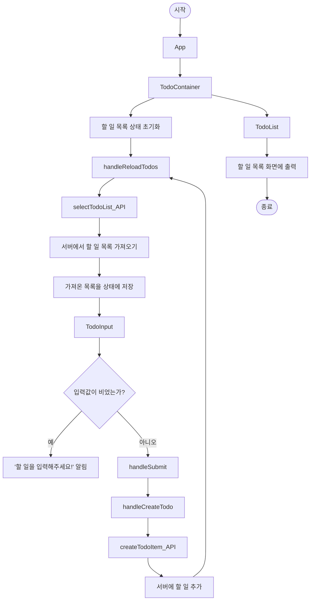

```mermaid
flowchart TD
    START([시작])
    START --> FUNC_App[App]
    FUNC_App --> FUNC_TodoContainer[TodoContainer]
    FUNC_TodoContainer --> PROCESS1["할 일 목록 상태 초기화"]
    PROCESS1 --> FUNC_handleReloadTodos[handleReloadTodos]
    FUNC_handleReloadTodos --> FUNC_selectTodoList["selectTodoList_API"]
    FUNC_selectTodoList --> PROCESS2["서버에서 할 일 목록 가져오기"]
    PROCESS2 --> PROCESS3["가져온 목록을 상태에 저장"]
    PROCESS3 --> FUNC_TodoInput[TodoInput]
    FUNC_TodoInput --> CONDITION1{"입력값이 비었는가?"}
    CONDITION1 -- 예 --> PROCESS4["'할 일을 입력해주세요!' 알림"]
    CONDITION1 -- 아니오 --> FUNC_handleSubmit[handleSubmit]
    FUNC_handleSubmit --> FUNC_handleCreateTodo[handleCreateTodo]
    FUNC_handleCreateTodo --> FUNC_createTodoItem["createTodoItem_API"]
    FUNC_createTodoItem --> PROCESS5["서버에 할 일 추가"]
    PROCESS5 --> FUNC_handleReloadTodos
    FUNC_TodoContainer --> FUNC_TodoList[TodoList]
    FUNC_TodoList --> PROCESS6["할 일 목록 화면에 출력"]
    PROCESS6 --> END([종료])
```