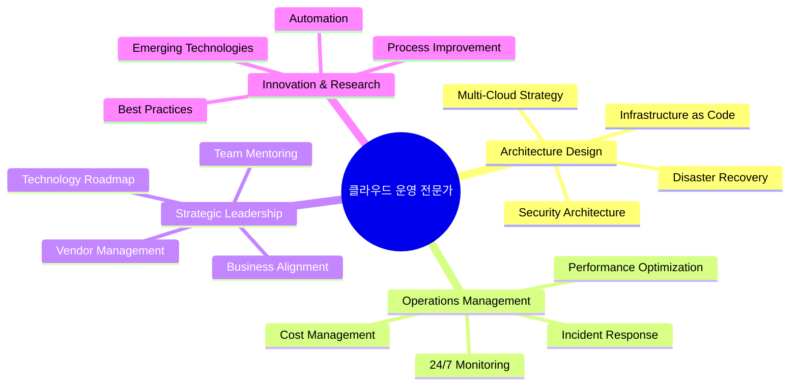

# 🌟 클라우드 운영 전문가 (Cloud Operations Expert) 완전 가이드

**엔터프라이즈 클라우드 인프라를 설계, 구축, 운영하는 최고 수준의 전문가**

---

## 🎯 클라우드 운영 전문가란?

클라우드 운영 전문가는 조직의 클라우드 인프라를 전략적으로 설계하고, 안정적으로 운영하며, 지속적으로 최적화하는 최고 수준의 기술 전문가입니다. 단순한 시스템 관리자를 넘어서 비즈니스 요구사항을 기술로 구현하는 전략적 파트너 역할을 수행합니다.

---

## 🏗️ 핵심 역할과 책임

### 📋 Primary Responsibilities



### 🎯 세부 역할 분석

#### 1. 인프라 아키텍트 (Infrastructure Architect)
```yaml
책임 영역:
  - 클라우드 아키텍처 설계 및 검토
  - 확장성과 가용성을 고려한 시스템 설계
  - 보안 아키텍처 구현
  - 재해 복구 계획 수립

핵심 기술:
  - AWS/Azure/GCP Well-Architected Framework
  - Infrastructure as Code (Terraform, CloudFormation)
  - Network Architecture (VPC, Subnets, Load Balancers)
  - Security Design (IAM, Zero Trust, Encryption)

업무 예시:
  - 글로벌 서비스를 위한 멀티 리전 아키텍처 설계
  - 마이크로서비스 아키텍처를 위한 서비스 메시 구현
  - 컴플라이언스 요구사항을 만족하는 보안 아키텍처 구축
```

#### 2. 플랫폼 엔지니어 (Platform Engineer)
```yaml
책임 영역:
  - 개발자 생산성 향상을 위한 플랫폼 구축
  - CI/CD 파이프라인 설계 및 운영
  - 컨테이너 오케스트레이션 플랫폼 관리
  - 개발 도구 및 환경 표준화

핵심 기술:
  - Kubernetes 클러스터 운영
  - GitOps (ArgoCD, Flux)
  - Service Mesh (Istio, Linkerd)
  - Developer Experience Tools

업무 예시:
  - 내부 개발팀을 위한 PaaS 플랫폼 구축
  - 자동화된 배포 파이프라인 구현
  - 개발 환경과 프로덕션 환경의 패리티 보장
```

#### 3. SRE (Site Reliability Engineer)
```yaml
책임 영역:
  - 시스템 안정성 및 성능 모니터링
  - 장애 대응 및 근본 원인 분석
  - SLI/SLO/SLA 정의 및 관리
  - 카오스 엔지니어링 구현

핵심 기술:
  - Observability (Prometheus, Grafana, Jaeger)
  - Log Management (ELK Stack, Fluentd)
  - APM (Application Performance Monitoring)
  - Chaos Engineering (Chaos Monkey, Litmus)

업무 예시:
  - 99.99% 가용성 목표 달성을 위한 모니터링 시스템 구축
  - 자동 복구 메커니즘 구현
  - 성능 병목 지점 식별 및 최적화
```

#### 4. 클라우드 보안 전문가 (Cloud Security Specialist)
```yaml
책임 영역:
  - 클라우드 보안 정책 수립 및 구현
  - 컴플라이언스 관리 (SOC2, ISO 27001, GDPR)
  - 보안 사고 대응 및 포렌식
  - Zero Trust 아키텍처 구현

핵심 기술:
  - Identity and Access Management (IAM)
  - Network Security (WAF, DDoS Protection)
  - Data Encryption (at rest, in transit)
  - Security Scanning and Compliance Tools

업무 예시:
  - 금융권 수준의 보안 아키텍처 구축
  - 자동화된 보안 검사 파이프라인 구현
  - 보안 인시던트 대응 프로세스 구축
```

#### 5. 클라우드 경제학자 (Cloud FinOps Specialist)
```yaml
책임 영역:
  - 클라우드 비용 최적화 전략 수립
  - 리소스 사용량 분석 및 최적화
  - 예산 계획 및 비용 예측
  - ROI 분석 및 보고

핵심 기술:
  - Cost Management Tools (AWS Cost Explorer, Azure Cost Management)
  - Resource Optimization (Right-sizing, Reserved Instances)
  - Tagging Strategy and Governance
  - Financial Modeling and Forecasting

업무 예시:
  - 연간 클라우드 비용 30% 절감 달성
  - 부서별 비용 할당 및 차지백 시스템 구축
  - 클라우드 ROI 분석 보고서 작성
```

---

## 🚀 기술 스택 및 전문성 요구사항

### 🏆 Expert Level (5년+ 경험)

#### 클라우드 플랫폼 전문성
```yaml
AWS (필수):
  - Solutions Architect Professional
  - DevOps Engineer Professional
  - Security Specialty
  
Azure (선택):
  - Azure Solutions Architect Expert
  - Azure DevOps Engineer Expert
  
GCP (선택):
  - Professional Cloud Architect
  - Professional DevOps Engineer

멀티클라우드 전략:
  - 클라우드 간 워크로드 마이그레이션
  - 하이브리드 클라우드 아키텍처
  - 클라우드 중립적 도구 활용
```

#### 컨테이너 및 오케스트레이션
```yaml
Kubernetes:
  - CKA (Certified Kubernetes Administrator)
  - CKS (Certified Kubernetes Security Specialist)
  - CKAD (Certified Kubernetes Application Developer)

컨테이너 생태계:
  - Docker 고급 활용
  - Helm 차트 개발
  - Operator 패턴 구현
  - 서비스 메시 운영 (Istio, Linkerd)

플랫폼 도구:
  - OpenShift 운영
  - Rancher 관리
  - Platform9 등 관리형 플랫폼
```

#### 자동화 및 IaC
```yaml
Infrastructure as Code:
  - Terraform (고급)
    * Provider 개발
    * Module 설계
    * State 관리 전략
  
  - CloudFormation/ARM Templates
  - Pulumi (선택)

Configuration Management:
  - Ansible Playbook 개발
  - Chef/Puppet (레거시 환경)

CI/CD 플랫폼:
  - Jenkins Pipeline (Groovy)
  - GitLab CI/CD
  - GitHub Actions
  - Azure DevOps
  - ArgoCD/Flux (GitOps)
```

#### 모니터링 및 관찰성
```yaml
메트릭 수집:
  - Prometheus 운영
  - InfluxDB 시계열 DB
  - CloudWatch/Azure Monitor

로그 관리:
  - ELK Stack (Elasticsearch, Logstash, Kibana)
  - Fluentd/Fluent Bit
  - Splunk (엔터프라이즈)

분산 추적:
  - Jaeger
  - Zipkin
  - AWS X-Ray

대시보드:
  - Grafana 고급 대시보드
  - Kibana 시각화
  - DataDog (SaaS)
```

#### 보안 및 컴플라이언스
```yaml
보안 도구:
  - Vault (Secret Management)
  - Falco (Runtime Security)
  - Open Policy Agent (OPA)
  - Twistlock/Prisma Cloud

컴플라이언스:
  - SOC 2 Type II
  - ISO 27001
  - PCI DSS
  - GDPR/CCPA

보안 스캐닝:
  - SAST/DAST 도구
  - Container Image Scanning
  - Infrastructure Security Scanning
```

---

## 💼 실무 프로젝트 예시

### 🏢 Enterprise 프로젝트 1: 글로벌 이커머스 플랫폼

**프로젝트 개요**:
- 일일 트랜잭션: 100만건
- 전 세계 20개국 서비스
- 99.99% 가용성 요구
- PCI DSS 컴플라이언스 필수

**기술 아키텍처**:
```yaml
Frontend:
  - React SPA on S3 + CloudFront
  - 멀티 리전 CDN 배포
  - A/B 테스트 플랫폼 통합

Backend:
  - Microservices on EKS (Kubernetes)
  - API Gateway (Kong/AWS API Gateway)
  - Service Mesh (Istio) for mTLS

Database:
  - Primary: Aurora PostgreSQL Multi-Master
  - Cache: ElastiCache Redis Cluster
  - Search: Amazon OpenSearch
  - Analytics: Redshift + S3 Data Lake

Security:
  - WAF with custom rules
  - Zero Trust network architecture
  - Encryption everywhere (TLS 1.3, AES-256)
  - HSM for payment processing

Monitoring:
  - Prometheus + Grafana
  - ELK Stack for centralized logging
  - Jaeger for distributed tracing
  - PagerDuty for incident management
```

**성과 지표**:
- 시스템 가용성: 99.998% 달성
- 평균 응답시간: 150ms → 80ms 개선
- 클라우드 비용: 25% 절감
- 배포 주기: 월 1회 → 일 5회

### 🏦 Enterprise 프로젝트 2: 금융 서비스 플랫폼

**프로젝트 개요**:
- 실시간 결제 처리 시스템
- 초당 10,000 TPS 처리
- 금융권 규제 준수 (Basel III)
- 제로 다운타임 요구

**기술 아키텍처**:
```yaml
Core Banking:
  - Event-driven architecture (Kafka)
  - CQRS + Event Sourcing 패턴
  - Polyglot persistence (PostgreSQL, MongoDB, Cassandra)

Real-time Processing:
  - Apache Kafka + Kafka Streams
  - Redis for session management
  - Apache Flink for complex event processing

Security:
  - Hardware Security Module (HSM)
  - Multi-factor authentication
  - End-to-end encryption
  - Audit logging with immutable records

Compliance:
  - Automated compliance checking
  - Data retention policies
  - GDPR privacy controls
  - Real-time fraud detection

Infrastructure:
  - Private cloud (OpenStack)
  - Disaster recovery in 3 regions
  - Automated failover (RTO < 1 minute)
  - Database replication with consistency checks
```

**성과 지표**:
- 처리 성능: 초당 15,000 TPS 달성
- 시스템 가용성: 99.999% (연간 5분 다운타임)
- 규제 감사: 100% 통과
- 보안 인시던트: 0건

---

## 📈 커리어 패스 및 성장 전략

### 🎯 레벨별 역할 정의

#### Junior Cloud Engineer (0-2년)
```yaml
주요 업무:
  - 기본적인 클라우드 리소스 관리
  - 모니터링 대시보드 관리
  - 기본적인 자동화 스크립트 작성
  - 문서화 및 프로세스 정리

필요 기술:
  - AWS/Azure 기초 지식
  - Linux 명령어 및 스크립팅
  - Docker 기본 사용법
  - Git 버전 관리

연봉 범위: $60,000 - $80,000
```

#### Mid-level Cloud Engineer (2-4년)
```yaml
주요 업무:
  - CI/CD 파이프라인 구축 및 관리
  - Infrastructure as Code 구현
  - 성능 최적화 및 비용 관리
  - 보안 정책 구현

필요 기술:
  - Kubernetes 운영 경험
  - Terraform/CloudFormation
  - 모니터링 도구 (Prometheus, Grafana)
  - 네트워킹 지식

연봉 범위: $80,000 - $120,000
```

#### Senior Cloud Engineer (4-7년)
```yaml
주요 업무:
  - 복잡한 클라우드 아키텍처 설계
  - 멀티 클라우드 전략 수립
  - 팀 멘토링 및 기술 리더십
  - 비즈니스 요구사항 분석

필요 기술:
  - 아키텍처 설계 경험
  - 여러 클라우드 플랫폼 전문성
  - 프로젝트 관리 경험
  - 비즈니스 이해도

연봉 범위: $120,000 - $160,000
```

#### Staff/Principal Cloud Architect (7-10년)
```yaml
주요 업무:
  - 엔터프라이즈 클라우드 전략 수립
  - 기술 로드맵 설계
  - 크로스 팀 협업 리더십
  - 혁신적 솔루션 연구

필요 기술:
  - 전략적 사고 능력
  - 조직 관리 및 리더십
  - 업계 트렌드 이해
  - 컨설팅 능력

연봉 범위: $160,000 - $220,000
```

#### Distinguished Engineer/VP of Cloud (10년+)
```yaml
주요 업무:
  - 조직의 기술 비전 수립
  - 산업 표준 개발 참여
  - 외부 컨퍼런스 발표
  - 전략적 파트너십 구축

필요 기술:
  - 산업 전문성
  - 사고 리더십
  - 글로벌 네트워킹
  - 혁신 창출 능력

연봉 범위: $220,000 - $400,000+
```

### 🏆 인증서 로드맵

#### Year 1-2: Foundation
```
☐ AWS Solutions Architect Associate
☐ AWS SysOps Administrator Associate
☐ CompTIA Cloud+
☐ Linux+ (선택)
```

#### Year 2-4: Specialization
```
☐ AWS Solutions Architect Professional
☐ AWS DevOps Engineer Professional
☐ Certified Kubernetes Administrator (CKA)
☐ HashiCorp Certified: Terraform Associate
```

#### Year 4-7: Expert Level
```
☐ AWS Security Specialty
☐ Certified Kubernetes Security Specialist (CKS)
☐ CISSP (정보보안)
☐ ITIL Foundation (서비스 관리)
```

#### Year 7+: Industry Recognition
```
☐ Industry speaking at major conferences
☐ Open source project contributions
☐ Technical blog/book authoring
☐ Mentoring and teaching
```

---

## 💰 보상 및 혜택 패키지

### 💵 글로벌 평균 연봉 (2024년 기준)

#### 지역별 연봉 비교
```yaml
미국 (실리콘밸리):
  Entry Level: $90,000 - $120,000
  Mid Level: $130,000 - $180,000
  Senior Level: $180,000 - $250,000
  Staff/Principal: $250,000 - $400,000

미국 (기타 지역):
  Entry Level: $70,000 - $95,000
  Mid Level: $100,000 - $140,000
  Senior Level: $140,000 - $200,000
  Staff/Principal: $200,000 - $300,000

유럽:
  Entry Level: €50,000 - €70,000
  Mid Level: €70,000 - €100,000
  Senior Level: €100,000 - €140,000
  Staff/Principal: €140,000 - €200,000

한국:
  Entry Level: ₩60,000,000 - ₩80,000,000
  Mid Level: ₩80,000,000 - ₩120,000,000
  Senior Level: ₩120,000,000 - ₩180,000,000
  Staff/Principal: ₩180,000,000 - ₩300,000,000
```

#### 추가 혜택 패키지
```yaml
Stock Options/RSU:
  - 연봉의 20-50% 수준
  - 4년 베스팅 스케줄
  - 상장 기업의 경우 즉시 현금화 가능

Performance Bonus:
  - 연봉의 10-30%
  - 개인/팀/회사 성과 연동
  - 분기별 또는 연간 지급

Education/Training:
  - 연간 $5,000 - $15,000 교육비 지원
  - 컨퍼런스 참가비 지원
  - 인증서 취득비 지원
  - 온라인 학습 플랫폼 구독

기타 혜택:
  - 유연 근무제 (재택/하이브리드)
  - 무제한 휴가 (일부 회사)
  - 건강보험 풀커버
  - 401k/퇴직연금 매칭
```

---

## 🌍 글로벌 취업 시장 및 기회

### 🏢 주요 채용 기업 Categories

#### 🚀 Big Tech Companies
```yaml
FAANG/MANGA:
  - Google (GCP 중심)
  - Amazon (AWS 본사)
  - Microsoft (Azure 중심)
  - Meta (Infrastructure)
  - Apple (Private Cloud)

특징:
  - 최고 수준의 보상 패키지
  - 글로벌 영향력
  - 최신 기술 도입
  - 높은 입사 난이도

요구사항:
  - 톱티어 대학 졸업 또는 동등한 경험
  - 알고리즘/시스템 설계 능력
  - 대규모 시스템 운영 경험
  - 영어 능력 (특히 미국 본사)
```

#### 🏦 Financial Services
```yaml
주요 기업:
  - JPMorgan Chase
  - Goldman Sachs
  - Morgan Stanley
  - BlackRock
  - Visa/Mastercard

특징:
  - 안정적인 고수입
  - 엄격한 규제 환경
  - 레거시 시스템 현대화
  - 보안 중요성

요구사항:
  - 금융 도메인 지식
  - 컴플라이언스 이해
  - 보안 전문성
  - 위험 관리 능력
```

#### ☁️ Cloud Service Providers
```yaml
전문 클라우드 기업:
  - Snowflake
  - Databricks
  - HashiCorp
  - MongoDB
  - Elastic

특징:
  - 클라우드 네이티브 기술
  - 급성장하는 시장
  - 기술 전문성 중시
  - 스톡옵션 기회

요구사항:
  - 해당 기술 스택 전문성
  - 클라우드 아키텍처 이해
  - 스타트업 경험 우대
  - 빠른 학습 능력
```

#### 🏭 Enterprise Consulting
```yaml
컨설팅 기업:
  - Deloitte
  - McKinsey Digital
  - BCG Digital Ventures
  - Accenture
  - IBM Consulting

특징:
  - 다양한 산업 경험
  - 글로벌 프로젝트
  - 컨설팅 스킬 개발
  - 네트워킹 기회

요구사항:
  - 비즈니스 이해도
  - 커뮤니케이션 능력
  - 프레젠테이션 스킬
  - 문제 해결 능력
```

### 🌏 지역별 시장 특성

#### 🇺🇸 미국 시장
```yaml
특징:
  - 가장 큰 클라우드 시장
  - 높은 연봉 수준
  - 다양한 기회
  - 기술 혁신 중심지

주요 허브:
  - 실리콘밸리 (최고 연봉)
  - 시애틀 (Amazon, Microsoft)
  - 뉴욕 (금융권)
  - 오스틴 (성장하는 테크 허브)

비자 고려사항:
  - H1B 비자 경쟁 치열
  - O1 비자 (특출한 능력자)
  - L1 비자 (다국적 기업 전근)
  - 그린카드 취득 시 장기 정착 가능
```

#### 🇪🇺 유럽 시장
```yaml
특징:
  - GDPR 등 규제 중심
  - 일과 삶의 균형 중시
  - 안정적인 고용 환경
  - 다국가 경험 가능

주요 허브:
  - 런던 (금융 중심지)
  - 베를린 (스타트업 허브)
  - 암스테르담 (다국적 기업)
  - 더블린 (테크 기업 유럽 본부)

비자/이민:
  - EU Blue Card (고급 인력)
  - 국가별 워크 비자
  - 유럽 내 이동 자유
  - 영어권 국가 선호
```

#### 🇦🇺 아시아-태평양
```yaml
주요 시장:
  - 싱가포르 (아시아 허브)
  - 홍콩 (금융 중심지)
  - 호주 (안정적 시장)
  - 일본 (기술 혁신)

특징:
  - 급성장하는 클라우드 시장
  - 다국적 기업 아시아 본부
  - 문화적 다양성
  - 상대적으로 낮은 진입 장벽

한국인 장점:
  - 아시아 시장 이해
  - 다국어 능력
  - 높은 기술 수준
  - 근면성실한 업무 태도
```

---

## 🎯 취업 준비 전략

### 📝 이력서/포트폴리오 구성

#### 기술 이력서 템플릿
```yaml
Contact Information:
  - LinkedIn 프로필
  - GitHub 포트폴리오
  - 기술 블로그
  - 온라인 포트폴리오 사이트

Summary (3-4줄):
  - X년 경력의 클라우드 전문가
  - 주요 성과 1-2개 수치화
  - 전문 기술 영역 명시
  - 구하는 포지션 언급

Technical Skills:
  Cloud Platforms: AWS (Expert), Azure (Intermediate)
  Containers: Docker, Kubernetes, Helm
  Infrastructure: Terraform, CloudFormation
  Monitoring: Prometheus, Grafana, ELK Stack
  Programming: Python, Go, Bash, YAML

Professional Experience:
  각 경험별로:
  - 회사명, 직책, 기간
  - 프로젝트 규모/영향도
  - 사용 기술 스택
  - 구체적 성과 (수치화)
  - 문제 해결 사례

Certifications & Education:
  - 관련 인증서 나열
  - 학위 정보 (간략히)
  - 지속적 학습 증거

Projects (GitHub Portfolio):
  - 개인/오픈소스 프로젝트
  - 실무 프로젝트 (공개 가능한 것)
  - 기술 블로그 포스팅
  - 컨퍼런스 발표
```

#### 포트폴리오 프로젝트 예시
```yaml
Project 1: Multi-Cloud Kubernetes Platform
  Description: "AWS, Azure, GCP에서 동작하는 통합 Kubernetes 플랫폼"
  Tech Stack: Terraform, Kubernetes, Istio, ArgoCD
  GitHub: github.com/username/multi-cloud-k8s
  Demo: platform-demo.example.com
  Impact: "개발팀 배포 시간 90% 단축"

Project 2: Infrastructure Cost Optimization
  Description: "AI를 활용한 클라우드 비용 최적화 도구"
  Tech Stack: Python, AWS Cost Explorer API, Machine Learning
  GitHub: github.com/username/cloud-cost-optimizer
  Results: "테스트 환경에서 월 $10K 비용 절감"

Project 3: Observability Stack
  Description: "마이크로서비스를 위한 완전한 관찰성 스택"
  Tech Stack: Prometheus, Grafana, Jaeger, ELK
  GitHub: github.com/username/observability-stack
  Features: "자동 알림, 분산 추적, 로그 집계"
```

### 🤝 면접 준비 전략

#### 기술 면접 준비
```yaml
시스템 설계 문제:
  - "Netflix 같은 스트리밍 서비스 설계"
  - "글로벌 결제 시스템 아키텍처"
  - "실시간 채팅 앱 인프라"
  - "데이터 파이프라인 설계"

준비 방법:
  1. 요구사항 명확화
  2. 고수준 아키텍처 스케치
  3. 컴포넌트별 기술 선택 설명
  4. 확장성/가용성 고려사항
  5. 트레이드오프 설명

예시 답변 구조:
  Requirements: "일일 활성 사용자 1000만명..."
  Architecture: "마이크로서비스 + API Gateway..."
  Scaling: "Auto Scaling Group + Load Balancer..."
  Database: "Primary-Replica + Caching..."
  Monitoring: "CloudWatch + 커스텀 메트릭..."
```

#### 행동 면접 준비 (STAR 방법)
```yaml
Situation: 상황 설명
Task: 해결해야 할 과제
Action: 취한 행동
Result: 결과 및 임팩트

예시 질문 및 답변:
Q: "어려운 기술적 문제를 해결한 경험은?"

A: 
Situation: "전사 서비스 99.9%에서 99.99%로 SLA 향상 요구"
Task: "기존 단일 리전에서 멀티 리전 DR 구축 필요"
Action: "Aurora Global Database + Route53 헬스체크 + 자동 페일오버"
Result: "가용성 99.995% 달성, RTO 5분 → 1분 단축"
```

### 🌐 네트워킹 및 브랜딩

#### 온라인 프레즌스 구축
```yaml
LinkedIn:
  - 기술 전문성 포스팅 (주 1-2회)
  - 업계 뉴스에 대한 인사이트 공유
  - 클라우드 커뮤니티 참여
  - 동료들과 활발한 네트워킹

기술 블로그:
  - Medium/개인 블로그 운영
  - 실무 경험 기반 기술 포스팅
  - 문제 해결 과정 공유
  - SEO 최적화로 검색 노출

GitHub:
  - 일관된 커밋 히스토리
  - 잘 정리된 README
  - 오픈소스 프로젝트 기여
  - 코드 품질 유지

컨퍼런스/밋업:
  - re:Invent, KubeCon 등 참석
  - 지역 클라우드 밋업 참여
  - 발표 기회 찾기
  - 업계 전문가들과 네트워킹
```

---

## 🔮 미래 전망 및 신기술 트렌드

### 🚀 Emerging Technologies

#### 1. AI/ML Operations (MLOps)
```yaml
기술 트렌드:
  - ML 모델 배포 자동화
  - 모델 성능 모니터링
  - A/B 테스트 플랫폼
  - 피처 스토어 관리

필요 기술:
  - Kubeflow, MLflow
  - Model serving (TensorFlow Serving, Seldon)
  - Data versioning (DVC)
  - ML 파이프라인 (Apache Airflow)

시장 기회:
  - AI 도입하는 모든 기업
  - 높은 연봉 프리미엄
  - 빠르게 성장하는 분야
  - 다양한 산업 적용
```

#### 2. Edge Computing
```yaml
기술 트렌드:
  - IoT 디바이스 관리
  - 5G 네트워크 활용
  - 실시간 데이터 처리
  - 로컬 컴퓨팅 최적화

필요 기술:
  - K3s (경량 Kubernetes)
  - AWS IoT Greengrass
  - Azure IoT Edge
  - 임베디드 시스템 지식

적용 분야:
  - 자율주행차
  - 스마트 시티
  - 산업 IoT
  - AR/VR 애플리케이션
```

#### 3. Quantum Computing
```yaml
기술 트렌드:
  - 양자 컴퓨팅 클라우드 서비스
  - 양자 알고리즘 개발
  - 하이브리드 클래식-양자 시스템
  - 양자 보안 프로토콜

클라우드 서비스:
  - IBM Quantum Network
  - AWS Braket
  - Azure Quantum
  - Google Quantum AI

장기 전망:
  - 암호화 패러다임 변화
  - 새로운 보안 아키텍처 필요
  - 특화된 전문가 수요 증가
  - 10년 후 상용화 예상
```

### 📊 2025-2030 시장 전망

#### 기술 수요 예측
```yaml
High Demand (계속 성장):
  - Multi-cloud management
  - Security automation
  - Cost optimization
  - Observability/APM

Emerging Demand (신규 성장):
  - MLOps/AIOps
  - Edge computing
  - Sustainable IT
  - Privacy engineering

Declining Demand (감소 예상):
  - 전통적 시스템 관리
  - 온프레미스 전용 기술
  - 수동 배포 프로세스
  - 모놀리식 아키텍처
```

#### 지역별 성장 전망
```yaml
아시아-태평양:
  - 연평균 25% 성장
  - 디지털 전환 가속화
  - 정부 클라우드 정책 지원
  - 스타트업 생태계 활성화

유럽:
  - 연평균 15% 성장
  - 데이터 주권 중요성 증가
  - 그린 IT 트렌드
  - 규제 기반 혁신

미국:
  - 연평균 12% 성장 (성숙 시장)
  - 기술 혁신 지속
  - 대규모 엔터프라이즈 전환
  - AI/ML 통합 가속화
```

---

## 🎓 추천 학습 리소스

### 📚 필수 도서
```yaml
아키텍처:
  - "Designing Data-Intensive Applications" - Martin Kleppmann
  - "Building Microservices" - Sam Newman
  - "Cloud Native Patterns" - Cornelia Davis

운영:
  - "Site Reliability Engineering" - Google SRE Team
  - "The DevOps Handbook" - Gene Kim
  - "Accelerate" - Nicole Forsgren

클라우드:
  - "AWS Well-Architected Framework" - AWS
  - "Cloud Strategy" - Gregor Hohpe
  - "Kubernetes in Action" - Marko Lukša
```

### 🎥 온라인 학습 플랫폼
```yaml
전문 플랫폼:
  - A Cloud Guru (클라우드 특화)
  - Linux Academy (시스템 관리)
  - Pluralsight (기술 전반)
  - Udemy (실습 중심)

공식 교육:
  - AWS Training and Certification
  - Microsoft Learn
  - Google Cloud Training
  - Kubernetes Academy

실습 환경:
  - Katacoda (브라우저 실습)
  - Play with Docker/Kubernetes
  - AWS Free Tier
  - Google Cloud Free Credits
```

### 🏆 커뮤니티 및 이벤트
```yaml
글로벌 커뮤니티:
  - CNCF (Cloud Native Computing Foundation)
  - AWS User Groups
  - Kubernetes Community
  - DevOps.com Community

한국 커뮤니티:
  - AWSKRUG (AWS 한국 사용자 그룹)
  - CloudNet@ (클라우드 네트워킹)
  - 쿠버네티스 사용자 모임
  - DevOps Korea

주요 컨퍼런스:
  - AWS re:Invent
  - KubeCon + CloudNativeCon
  - DockerCon
  - DevOps World
```

---

**🌟 결론**: 

클라우드 운영 전문가는 현재 IT 업계에서 가장 유망하고 높은 보상을 받는 직업 중 하나입니다. 기술적 전문성뿐만 아니라 비즈니스 이해도, 리더십, 그리고 지속적인 학습 능력이 필요한 종합적인 역할입니다.

**핵심 성공 요소**:
1. **기술적 깊이**: 특정 영역에서의 전문성
2. **비즈니스 이해**: 기술을 비즈니스 가치로 연결
3. **리더십**: 팀과 프로젝트를 이끄는 능력
4. **지속적 학습**: 빠르게 변화하는 기술 트렌드 적응

현재의 Todo 프로젝트에서 시작하여 단계적으로 확장해 나가면서, 각 단계에서 발생하는 실제 문제들을 해결하는 경험을 쌓는 것이 가장 효과적인 성장 전략입니다.
