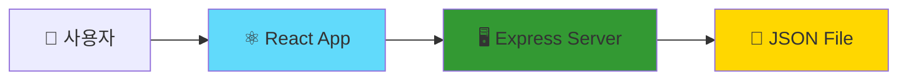
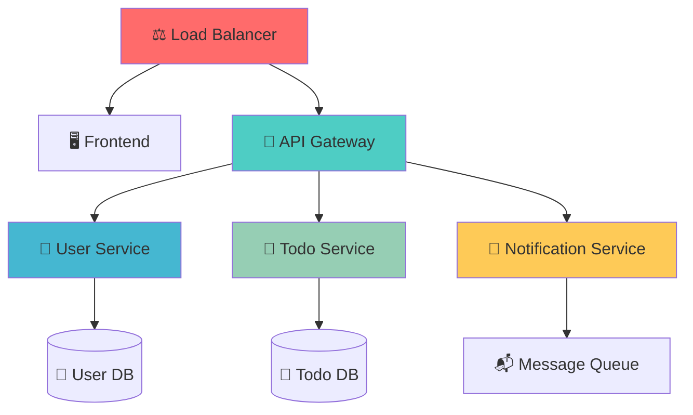
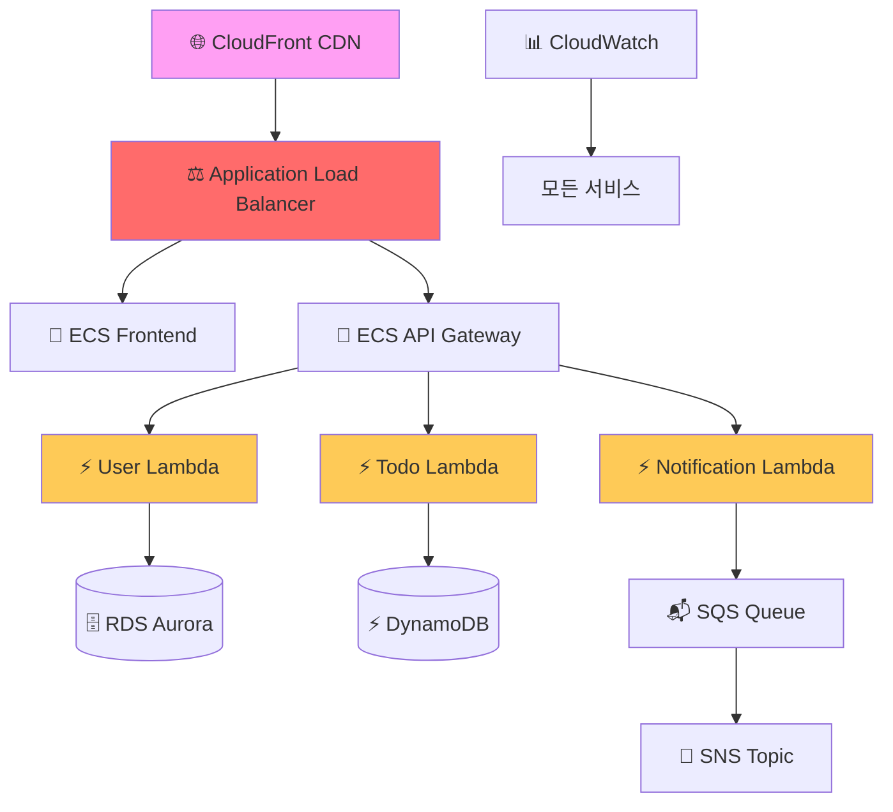
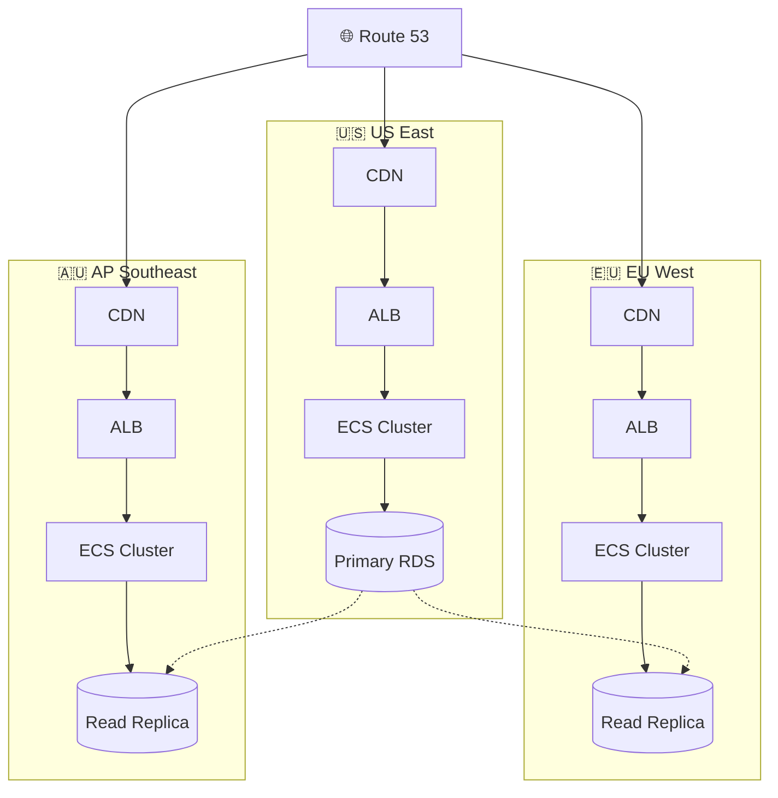
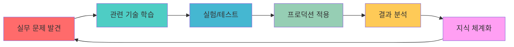

# 🚀 React Todo 프로젝트에서 파생되는 클라우드 운영 인사이트

**소규모 프로젝트에서 엔터프라이즈급 클라우드 아키텍처로의 진화 인사이트**

---

## 🎯 프로젝트 진화 인사이트 개요

현재의 간단한 Todo 애플리케이션은 클라우드 운영의 모든 핵심 개념을 포함하고 있습니다. 이 문서는 작은 프로젝트에서 시작하여 대규모 엔터프라이즈 시스템으로 확장하는 과정에서 얻을 수 있는 핵심 인사이트를 담고 있습니다.

---

## 📊 규모별 아키텍처 진화 인사이트

### 🏠 Phase 1: 단일 애플리케이션 (현재 상태)


**운영 인사이트**:
- **단순함의 가치**: 복잡성 없이 핵심 기능 구현
- **빠른 프로토타이핑**: 아이디어를 신속하게 검증
- **학습 효율성**: 전체 스택을 한눈에 파악 가능

**실무 적용**:
- MVP (Minimum Viable Product) 개발
- 스타트업 초기 단계 아키텍처
- 개념 증명 (PoC) 프로젝트

### 🏢 Phase 2: 마이크로서비스 분리 (10만 사용자)


**확장 인사이트**:
- **서비스 분리의 타이밍**: 언제, 왜 마이크로서비스로 전환해야 하는가?
- **데이터 일관성**: 분산 트랜잭션 vs 최종 일관성
- **서비스 간 통신**: 동기 vs 비동기 통신 패턴

**현실적 도전과제**:
```javascript
// 문제 1: 분산 트랜잭션
// Todo 생성 + 사용자 알림을 어떻게 원자적으로 처리할 것인가?

// 해결책: Saga 패턴 구현
class TodoCreationSaga {
  async execute(userId, todoData) {
    try {
      // 1. Todo 생성
      const todo = await todoService.create(todoData);
      
      // 2. 알림 전송
      await notificationService.send(userId, {
        type: 'TODO_CREATED',
        todoId: todo.id
      });
      
      return todo;
    } catch (error) {
      // 보상 트랜잭션 실행
      await this.compensate(todo?.id);
      throw error;
    }
  }
}
```

### 🏭 Phase 3: 클라우드 네이티브 (100만 사용자)


**클라우드 네이티브 인사이트**:

1. **서버리스의 진짜 가치**
   ```yaml
   # 기존 인식: "서버 관리 안 해도 됨"
   # 실제 가치: "비즈니스 로직에만 집중"
   
   비용 최적화:
   - 실행 시간만 과금
   - 자동 스케일링
   - 운영 오버헤드 제거
   
   개발 효율성:
   - 인프라 추상화
   - 빠른 배포 사이클
   - 기능별 독립 배포
   ```

2. **관리형 서비스의 전략적 활용**
   ```javascript
   // Before: 직접 구현
   class CacheManager {
     constructor() {
       this.redis = new Redis();
       this.cluster = new RedisCluster();
     }
     
     async setup() {
       // 복잡한 설정 및 모니터링 구현
     }
   }
   
   // After: 관리형 서비스 활용
   const cache = new AWS.ElastiCache.Redis({
     // 설정만 하면 됨
     nodeType: 'cache.r6g.large',
     numCacheNodes: 3,
     automaticFailoverEnabled: true
   });
   ```

### 🌍 Phase 4: 글로벌 멀티 리전 (1000만 사용자)


**글로벌 운영 인사이트**:

1. **데이터 주권과 지연시간**
   ```javascript
   // 지역별 데이터 라우팅 전략
   class GlobalTodoService {
     constructor() {
       this.regions = {
         'us-east-1': { latency: 20, compliance: 'SOC2' },
         'eu-west-1': { latency: 30, compliance: 'GDPR' },
         'ap-southeast-1': { latency: 50, compliance: 'Local' }
       };
     }
     
     async routeRequest(userLocation, request) {
       const optimalRegion = this.selectRegion(userLocation);
       return await this.processInRegion(optimalRegion, request);
     }
   }
   ```

2. **재해 복구 전략**
   ```yaml
   RTO (Recovery Time Objective): 15분
   RPO (Recovery Point Objective): 5분
   
   전략:
   - Multi-AZ 배포: 99.99% 가용성
   - Cross-Region 백업: 재해 복구
   - Blue-Green 배포: 무중단 업데이트
   ```

---

## 🔍 운영 복잡성의 진화 인사이트

### 📈 복잡성 지표별 비교

| 항목 | 단일 앱 | 마이크로서비스 | 클라우드 네이티브 | 글로벌 멀티리전 |
|------|---------|----------------|-------------------|-----------------|
| **배포 복잡성** | ⭐ | ⭐⭐⭐ | ⭐⭐⭐⭐ | ⭐⭐⭐⭐⭐ |
| **모니터링** | ⭐ | ⭐⭐⭐ | ⭐⭐⭐⭐ | ⭐⭐⭐⭐⭐ |
| **보안 관리** | ⭐ | ⭐⭐⭐ | ⭐⭐⭐⭐ | ⭐⭐⭐⭐⭐ |
| **비용 관리** | ⭐ | ⭐⭐ | ⭐⭐⭐⭐ | ⭐⭐⭐⭐⭐ |
| **성능 최적화** | ⭐⭐ | ⭐⭐⭐ | ⭐⭐⭐⭐ | ⭐⭐⭐⭐⭐ |

### 🎯 단계별 핵심 학습 포인트

**1단계: 기초 운영 (현재 Todo 앱)**
```bash
# 학습해야 할 기본 명령어들
docker build -t todo-app .
docker run -p 3000:3000 todo-app
docker-compose up -d

# 로그 모니터링
docker logs -f todo-app
tail -f /var/log/app.log

# 성능 모니터링
top
htop
iostat
```

**2단계: 컨테이너 오케스트레이션**
```yaml
# Kubernetes 매니페스트 예시
apiVersion: apps/v1
kind: Deployment
metadata:
  name: todo-frontend
spec:
  replicas: 3
  selector:
    matchLabels:
      app: todo-frontend
  template:
    metadata:
      labels:
        app: todo-frontend
    spec:
      containers:
      - name: frontend
        image: todo-app:latest
        ports:
        - containerPort: 3000
        resources:
          requests:
            memory: "128Mi"
            cpu: "100m"
          limits:
            memory: "256Mi"
            cpu: "200m"
```

**3단계: 클라우드 서비스 통합**
```python
# Terraform으로 인프라 코드화
resource "aws_ecs_service" "todo_app" {
  name            = "todo-app"
  cluster         = aws_ecs_cluster.main.id
  task_definition = aws_ecs_task_definition.todo_app.arn
  desired_count   = 3

  load_balancer {
    target_group_arn = aws_lb_target_group.todo_app.arn
    container_name   = "todo-app"
    container_port   = 3000
  }

  deployment_configuration {
    maximum_percent         = 200
    minimum_healthy_percent = 100
  }
}
```

---

## 🚨 실무에서 마주치는 현실적 문제들

### Problem 1: 트래픽 급증 대응
```javascript
// 상황: 갑작스런 트래픽 증가로 서버 다운
// Before: 수동 스케일링
app.get('/todos', async (req, res) => {
  const todos = await db.query('SELECT * FROM todos');
  res.json(todos);
});

// After: 캐싱 + 자동 스케일링
const redis = require('redis');
const cache = redis.createClient();

app.get('/todos', async (req, res) => {
  // 1. 캐시 확인
  const cached = await cache.get(`todos:${req.user.id}`);
  if (cached) {
    return res.json(JSON.parse(cached));
  }
  
  // 2. DB 조회
  const todos = await db.query('SELECT * FROM todos WHERE user_id = ?', [req.user.id]);
  
  // 3. 캐시 저장 (5분 TTL)
  await cache.setex(`todos:${req.user.id}`, 300, JSON.stringify(todos));
  
  res.json(todos);
});
```

### Problem 2: 서비스 간 장애 전파
```javascript
// Circuit Breaker 패턴 구현
class CircuitBreaker {
  constructor(service, threshold = 5, resetTimeout = 60000) {
    this.service = service;
    this.threshold = threshold;
    this.resetTimeout = resetTimeout;
    this.failureCount = 0;
    this.state = 'CLOSED'; // CLOSED, OPEN, HALF_OPEN
    this.nextAttempt = Date.now();
  }

  async call(...args) {
    if (this.state === 'OPEN') {
      if (Date.now() < this.nextAttempt) {
        throw new Error('Circuit breaker is OPEN');
      }
      this.state = 'HALF_OPEN';
    }

    try {
      const result = await this.service(...args);
      this.onSuccess();
      return result;
    } catch (error) {
      this.onFailure();
      throw error;
    }
  }

  onSuccess() {
    this.failureCount = 0;
    this.state = 'CLOSED';
  }

  onFailure() {
    this.failureCount++;
    if (this.failureCount >= this.threshold) {
      this.state = 'OPEN';
      this.nextAttempt = Date.now() + this.resetTimeout;
    }
  }
}

// 사용 예시
const notificationService = new CircuitBreaker(
  async (userId, message) => {
    return await fetch(`/api/notifications`, {
      method: 'POST',
      body: JSON.stringify({ userId, message })
    });
  }
);
```

### Problem 3: 데이터베이스 성능 저하
```sql
-- 문제: N+1 쿼리
-- 각 사용자의 Todo 개수를 가져오는 비효율적인 방법
-- SELECT * FROM users;
-- 그 다음 각 사용자별로:
-- SELECT COUNT(*) FROM todos WHERE user_id = ?;

-- 해결: 조인을 활용한 효율적 쿼리
SELECT 
  u.id,
  u.name,
  u.email,
  COALESCE(t.todo_count, 0) as todo_count
FROM users u
LEFT JOIN (
  SELECT 
    user_id, 
    COUNT(*) as todo_count
  FROM todos 
  GROUP BY user_id
) t ON u.id = t.user_id;
```

---

## 📊 비용 최적화 인사이트

### 💰 단계별 비용 구조 변화

**Phase 1: 단일 서버 ($50/월)**
```
- EC2 t3.medium: $35/월
- RDS t3.micro: $15/월
- 총 비용: $50/월
```

**Phase 2: 마이크로서비스 ($300/월)**
```
- ECS Fargate (3 서비스): $150/월
- RDS Multi-AZ: $100/월
- ElastiCache: $50/월
- 총 비용: $300/월
```

**Phase 3: 클라우드 네이티브 ($800/월)**
```
- Lambda 실행 비용: $200/월
- DynamoDB: $150/월
- API Gateway: $100/월
- CloudFront CDN: $100/월
- 모니터링 (CloudWatch): $50/월
- 기타 AWS 서비스: $200/월
- 총 비용: $800/월
```

**Phase 4: 글로벌 멀티리전 ($2,500/월)**
```
- 3개 리전 인프라: $2,000/월
- 데이터 전송 비용: $300/월
- 글로벌 모니터링: $200/월
- 총 비용: $2,500/월
```

### 🎯 비용 최적화 전략

1. **Reserved Instance 활용**
   ```bash
   # 1년 약정으로 최대 75% 할인
   # 예측 가능한 워크로드에 적용
   
   # 비용 계산기 활용
   aws pricing get-products --service-code AmazonEC2
   ```

2. **스팟 인스턴스 활용**
   ```yaml
   # ECS에서 스팟 인스턴스 활용
   capacityProviders:
     - name: "spot-capacity-provider"
       capacityProviderStrategy:
         - capacityProvider: "spot-capacity-provider"
           weight: 2
           base: 0
         - capacityProvider: "on-demand-capacity-provider"
           weight: 1
           base: 1
   ```

3. **자동 스케일링 정책**
   ```javascript
   // CloudWatch 메트릭 기반 스케일링
   const scalingPolicy = {
     PolicyName: 'cpu-scaling-policy',
     PolicyType: 'TargetTrackingScaling',
     TargetTrackingScalingPolicies: [{
       TargetValue: 70.0,
       PredefinedMetricSpecification: {
         PredefinedMetricType: 'ASGAverageCPUUtilization'
       }
     }]
   };
   ```

---

## 🔐 보안 진화 인사이트

### 🛡️ 보안 요구사항의 변화

**단일 애플리케이션 보안**:
```javascript
// 기본적인 인증/인가
const jwt = require('jsonwebtoken');

app.post('/login', async (req, res) => {
  const { username, password } = req.body;
  
  // 패스워드 해시 검증
  const isValid = await bcrypt.compare(password, user.passwordHash);
  
  if (isValid) {
    const token = jwt.sign({ userId: user.id }, process.env.JWT_SECRET);
    res.json({ token });
  }
});
```

**마이크로서비스 보안**:
```yaml
# Service Mesh를 통한 mTLS
apiVersion: security.istio.io/v1beta1
kind: PeerAuthentication
metadata:
  name: default
spec:
  mtls:
    mode: STRICT

---
apiVersion: security.istio.io/v1beta1
kind: AuthorizationPolicy
metadata:
  name: todo-policy
spec:
  selector:
    matchLabels:
      app: todo-service
  rules:
  - from:
    - source:
        principals: ["cluster.local/ns/default/sa/api-gateway"]
  - to:
    - operation:
        methods: ["GET", "POST"]
```

**클라우드 네이티브 보안**:
```json
{
  "Version": "2012-10-17",
  "Statement": [
    {
      "Effect": "Allow",
      "Principal": {
        "AWS": "arn:aws:iam::123456789012:role/LambdaExecutionRole"
      },
      "Action": "dynamodb:PutItem",
      "Resource": "arn:aws:dynamodb:us-east-1:123456789012:table/Todos",
      "Condition": {
        "ForAnyValue:StringEquals": {
          "dynamodb:Attributes": ["id", "title", "completed", "userId"]
        }
      }
    }
  ]
}
```

---

## 🎓 클라우드 운영 전문가로 성장하는 핵심 인사이트

### 1. 기술적 깊이 vs 폭의 균형
```
전문 영역 (깊이):
├── AWS/Azure/GCP 중 1개 전문
├── Kubernetes 운영
└── 모니터링/관찰성

폭넓은 이해 (폭):
├── 네트워킹 기초
├── 보안 기초
├── 데이터베이스 기초
└── 개발 프로세스 이해
```

### 2. 비즈니스 이해의 중요성
```javascript
// 기술자 관점: "이 API는 100ms 이내에 응답해야 한다"
// 비즈니스 관점: "사용자 이탈률을 줄이기 위해 빠른 응답이 필요하다"

class CloudArchitect {
  designSolution(requirements) {
    // 1. 비즈니스 요구사항 분석
    const businessGoals = this.analyzeBusiness(requirements);
    
    // 2. 기술적 제약사항 고려
    const techConstraints = this.analyzeTechnical(requirements);
    
    // 3. 비용 효율성 고려
    const costOptimization = this.analyzeCost(requirements);
    
    // 4. 통합 솔루션 설계
    return this.synthesize(businessGoals, techConstraints, costOptimization);
  }
}
```

### 3. 지속적 학습의 체계화


---

**💡 최종 인사이트**: 
현재의 작은 Todo 프로젝트는 클라우드 운영의 모든 핵심 요소를 담고 있습니다. 
단계적으로 확장하며 각 단계에서 발생하는 문제들을 직접 해결해보는 것이 
가장 효과적인 학습 방법입니다. 

**실무에서는 완벽한 아키텍처보다 비즈니스 요구사항을 만족하는 
실용적인 솔루션이 더 가치 있습니다.**
