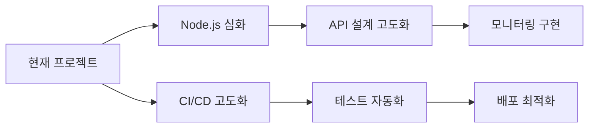
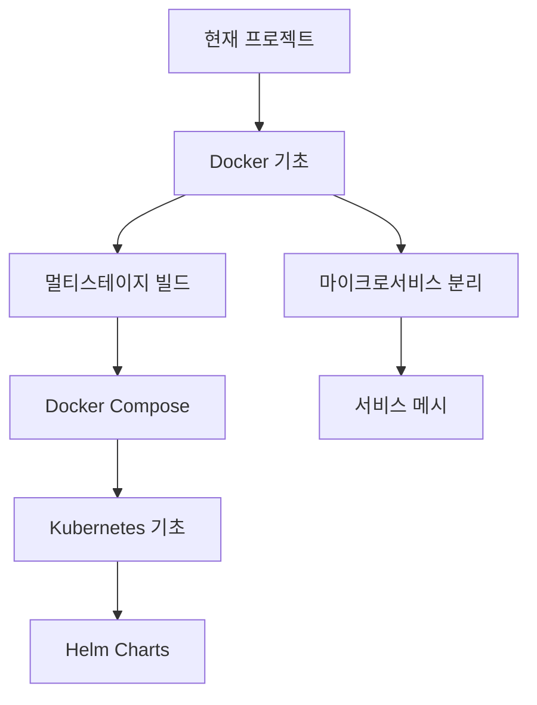
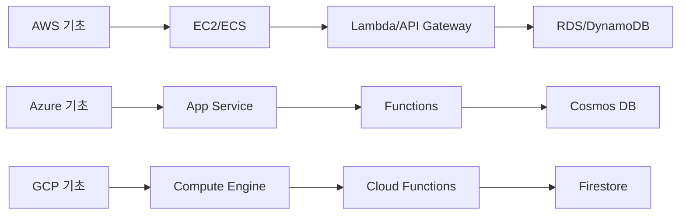
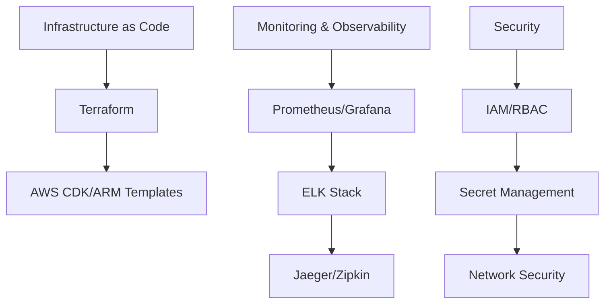

# 🌐 현재 프로젝트 기술 스택과 클라우드 운영 전문가 관련성 분석

**클라우드 운영 전문가로의 성장을 위한 기술 스택 로드맵**

---

## 📋 현재 프로젝트 기술 스택 분석

### 🖥️ Frontend 기술
| 기술 | 현재 프로젝트 | 클라우드 운영에서의 역할 | 학습 우선순위 |
|------|---------------|-------------------------|---------------|
| **React** | ⚛️ UI 프레임워크 | 마이크로프론트엔드, SPA 배포 최적화 | ⭐⭐⭐ |
| **JavaScript/ES6+** | 🔧 프로그래밍 언어 | 자동화 스크립트, API 개발 | ⭐⭐⭐⭐ |
| **HTML/CSS** | 🎨 마크업/스타일 | 정적 사이트 최적화, CDN 활용 | ⭐⭐ |
| **CSS Modules** | 🏗️ 모듈화 스타일링 | 마이크로서비스 UI 아키텍처 | ⭐⭐ |

### 🔧 Backend & API 기술
| 기술 | 현재 프로젝트 | 클라우드 운영에서의 역할 | 학습 우선순위 |
|------|---------------|-------------------------|---------------|
| **Node.js** | 🖥️ 런타임 환경 | 서버리스 함수, 마이크로서비스 | ⭐⭐⭐⭐⭐ |
| **Express.js** | 🌐 웹 프레임워크 | API 게이트웨이, 마이크로서비스 | ⭐⭐⭐⭐ |
| **RESTful API** | 📡 API 설계 | 마이크로서비스 통신, API 관리 | ⭐⭐⭐⭐⭐ |
| **JSON Server** | 💾 Mock API | 프로토타이핑, 개발 환경 구성 | ⭐⭐ |

### 🧪 Testing & Quality
| 기술 | 현재 프로젝트 | 클라우드 운영에서의 역할 | 학습 우선순위 |
|------|---------------|-------------------------|---------------|
| **Jest** | ✅ 단위 테스트 | CI/CD 파이프라인, 품질 보증 | ⭐⭐⭐⭐ |
| **React Testing Library** | 🔍 컴포넌트 테스트 | 프론트엔드 테스트 자동화 | ⭐⭐⭐ |

### 🚀 DevOps & Deployment
| 기술 | 현재 프로젝트 | 클라우드 운영에서의 역할 | 학습 우선순위 |
|------|---------------|-------------------------|---------------|
| **GitHub Actions** | 🔄 CI/CD | 자동화 파이프라인, GitOps | ⭐⭐⭐⭐⭐ |
| **Vercel** | ☁️ 서버리스 배포 | JAMstack, Edge Computing | ⭐⭐⭐⭐ |
| **GitHub Pages** | 📄 정적 사이트 호스팅 | CDN, 정적 자산 관리 | ⭐⭐⭐ |
| **npm/package.json** | 📦 패키지 관리 | 의존성 관리, 컨테이너 최적화 | ⭐⭐⭐ |

---

## 🎯 클라우드 운영 전문가로의 기술 확장 로드맵

### Phase 1: 현재 기술 심화 (1-2개월)


**구체적 학습 항목**:
- **Node.js 클러스터링**: PM2, 로드 밸런싱
- **API 문서화**: OpenAPI/Swagger, API 버전 관리
- **로깅 및 모니터링**: Winston, Morgan, 헬스체크 엔드포인트
- **성능 최적화**: 캐싱, 압축, 번들 최적화

### Phase 2: 컨테이너화 및 오케스트레이션 (2-3개월)


**프로젝트 적용 방안**:
1. **Frontend 컨테이너화**
   ```dockerfile
   FROM node:18-alpine as builder
   WORKDIR /app
   COPY package*.json ./
   RUN npm ci --only=production
   COPY . .
   RUN npm run build
   
   FROM nginx:alpine
   COPY --from=builder /app/build /usr/share/nginx/html
   EXPOSE 80
   CMD ["nginx", "-g", "daemon off;"]
   ```

2. **Backend API 컨테이너화**
   ```dockerfile
   FROM node:18-alpine
   WORKDIR /app
   COPY package*.json ./
   RUN npm ci --only=production
   COPY . .
   EXPOSE 5000
   USER node
   CMD ["node", "server.js"]
   ```

### Phase 3: 클라우드 네이티브 기술 (3-4개월)


**현재 프로젝트를 클라우드로 마이그레이션**:

1. **AWS 아키텍처**
   - Frontend: S3 + CloudFront
   - Backend: Lambda + API Gateway
   - Database: DynamoDB
   - CI/CD: CodePipeline + CodeBuild

2. **Azure 아키텍처**
   - Frontend: Static Web Apps
   - Backend: Azure Functions
   - Database: Cosmos DB
   - CI/CD: Azure DevOps

### Phase 4: 고급 클라우드 운영 (4-6개월)


---

## 🛠️ 실용적 학습 전략

### 1. 현재 프로젝트 기반 점진적 확장

**Week 1-2: 모니터링 추가**
```javascript
// 현재 server.js에 헬스체크 및 메트릭 추가
const express = require('express');
const prometheus = require('prom-client');

const app = express();

// 프로메테우스 메트릭 설정
const httpRequestDuration = new prometheus.Histogram({
  name: 'http_request_duration_ms',
  help: 'Duration of HTTP requests in ms',
  labelNames: ['method', 'route', 'status'],
});

// 헬스체크 엔드포인트
app.get('/health', (req, res) => {
  res.status(200).json({
    status: 'healthy',
    timestamp: new Date().toISOString(),
    uptime: process.uptime()
  });
});

// 메트릭 엔드포인트
app.get('/metrics', (req, res) => {
  res.set('Content-Type', prometheus.register.contentType);
  res.end(prometheus.register.metrics());
});
```

**Week 3-4: Docker 컨테이너화**
```yaml
# docker-compose.yml
version: '3.8'
services:
  frontend:
    build:
      context: .
      dockerfile: Dockerfile.frontend
    ports:
      - "3000:80"
    depends_on:
      - backend
      
  backend:
    build:
      context: .
      dockerfile: Dockerfile.backend
    ports:
      - "5000:5000"
    environment:
      - NODE_ENV=production
    depends_on:
      - database
      
  database:
    image: postgres:14
    environment:
      POSTGRES_DB: todoapp
      POSTGRES_USER: user
      POSTGRES_PASSWORD: password
    volumes:
      - postgres_data:/var/lib/postgresql/data
      
volumes:
  postgres_data:
```

### 2. 인증서 취득 로드맵

**우선순위별 인증서**:
1. **AWS Solutions Architect Associate** (필수)
2. **Kubernetes Administrator (CKA)** (중요)
3. **Azure Fundamentals + Azure Administrator** (옵션)
4. **Terraform Associate** (권장)

### 3. 포트폴리오 구성 전략

**레벨 1: 현재 프로젝트 고도화**
- ✅ 이미 완성된 Todo 앱
- 🔄 Docker 컨테이너화
- 📊 모니터링 대시보드 추가
- 🔒 인증/인가 시스템 구현

**레벨 2: 마이크로서비스 분리**
```
todo-app/
├── frontend-service/     # React 앱
├── user-service/        # 사용자 관리
├── todo-service/        # Todo CRUD
├── notification-service/ # 알림 서비스
├── api-gateway/         # API 게이트웨이
└── monitoring/          # 모니터링 스택
```

**레벨 3: 클라우드 네이티브 전환**
- Kubernetes 클러스터 배포
- Helm 차트 작성
- CI/CD 파이프라인 구축
- 서비스 메시 (Istio) 적용

---

## 📈 취업 시장 분석 및 준비 전략

### 클라우드 운영 전문가 요구 기술 순위

**1순위 (필수)**:
- ☁️ AWS/Azure/GCP 중 1개 이상 전문성
- 🐳 Docker & Kubernetes
- 🔧 Infrastructure as Code (Terraform)
- 📊 모니터링 (Prometheus, Grafana)

**2순위 (중요)**:
- 🔄 CI/CD (Jenkins, GitLab, GitHub Actions)
- 🐧 Linux 시스템 관리
- 🔒 보안 (IAM, 네트워크 보안)
- 📝 스크립팅 (Python, Bash, Go)

**3순위 (우대)**:
- 🕸️ 서비스 메시 (Istio, Linkerd)
- 📈 APM (Application Performance Monitoring)
- 🏗️ 마이크로서비스 아키텍처
- 🤖 자동화 도구 (Ansible, Chef, Puppet)

### 현재 프로젝트 활용 면접 전략

**기술 면접 예상 질문과 답변**:

1. **"현재 Todo 앱을 AWS에서 확장 가능하게 배포한다면?"**
   ```
   답변 구조:
   - Frontend: S3 + CloudFront (글로벌 CDN)
   - Backend: ECS Fargate (오토스케일링)
   - Database: RDS Multi-AZ (고가용성)
   - 캐시: ElastiCache Redis
   - 모니터링: CloudWatch + X-Ray
   ```

2. **"트래픽이 급증할 때 어떻게 대응하겠는가?"**
   ```
   답변 구조:
   - 수평적 확장: ALB + Auto Scaling Group
   - 데이터베이스: Read Replica 활용
   - 캐싱 전략: CDN + Application Cache
   - 비동기 처리: SQS + Lambda
   ```

---

## 🎯 6개월 학습 플랜

### Month 1-2: Foundation
- [ ] 현재 프로젝트 Docker 컨테이너화
- [ ] Prometheus/Grafana 모니터링 구축
- [ ] AWS 기초 실습 (EC2, S3, RDS)
- [ ] Linux 기본 명령어 및 스크립팅

### Month 3-4: Intermediate
- [ ] Kubernetes 클러스터 구축
- [ ] Terraform으로 인프라 코드화
- [ ] CI/CD 파이프라인 고도화
- [ ] AWS SAA 인증서 취득

### Month 5-6: Advanced
- [ ] 마이크로서비스 아키텍처 구현
- [ ] 서비스 메시 (Istio) 적용
- [ ] 보안 강화 (IAM, 네트워크)
- [ ] CKA 인증서 취득

---

**💡 핵심 메시지**: 현재 프로젝트는 클라우드 운영 전문가로 성장하기 위한 완벽한 기반입니다. 단계적으로 확장하며 실무 경험을 쌓아가세요!
