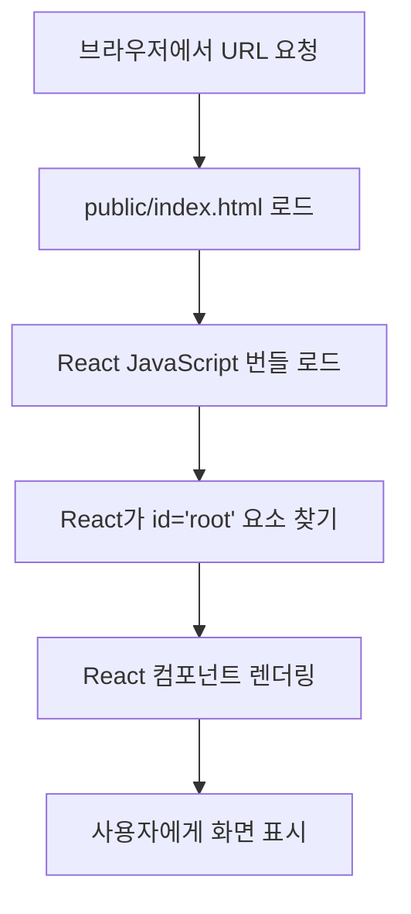

# Chapter 6: public/index.html - React 앱의 진입점

## 📚 학습 목표
- public/index.html 파일의 역할과 구조 이해
- React 앱이 HTML에 마운트되는 과정 파악
- 메타 태그와 SEO 최적화 방법 학습
- PWA 설정과 매니페스트 파일 이해
- 파비콘과 정적 파일 관리 방법

## 🔗 필요한 사전 지식
- Chapter 1: HTML 기초
- Chapter 4: React 기초
- Chapter 5: package.json 이해

---

## 1. public/index.html의 역할

**public/index.html**은 React 앱의 **진입점(Entry Point)**이 되는 HTML 파일입니다.

### 1.1 왜 index.html이 필요한가?
- **SPA의 기반**: Single Page Application의 기본 HTML 구조
- **React 마운트 포인트**: React 컴포넌트가 렌더링될 위치 제공
- **메타데이터 설정**: SEO, 브라우저 설정 등
- **정적 리소스 로딩**: CSS, 폰트, 아이콘 등

### 1.2 React 앱 로딩 과정


---

## 2. 우리 프로젝트의 index.html 분석

```html
<!DOCTYPE html>
<html lang="en">
  <head>
    <meta charset="utf-8" />
    <link rel="icon" href="%PUBLIC_URL%/favicon.ico" />
    <meta name="viewport" content="width=device-width, initial-scale=1" />
    <meta name="theme-color" content="#000000" />
    <meta
      name="description"
      content="Web site created using create-react-app"
    />
    <link rel="apple-touch-icon" href="%PUBLIC_URL%/logo192.png" />
    <link rel="manifest" href="%PUBLIC_URL%/manifest.json" />
    <title>React App</title>
  </head>
  <body>
    <noscript>You need to enable JavaScript to run this app.</noscript>
    <div id="root"></div>
  </body>
</html>
```

---

## 3. HTML 구조 상세 분석

### 3.1 DOCTYPE과 HTML 태그
```html
<!DOCTYPE html>
<html lang="en">
```

**설명:**
- `<!DOCTYPE html>`: HTML5 문서 선언
- `lang="en"`: 문서 언어 설정 (SEO와 접근성에 중요)
- **개선 예시**: `lang="ko"`로 변경하여 한국어 지원

### 3.2 문자 인코딩과 기본 메타 태그
```html
<meta charset="utf-8" />
<meta name="viewport" content="width=device-width, initial-scale=1" />
```

**각 태그의 역할:**
- `charset="utf-8"`: Unicode 문자 인코딩 (한글, 이모지 지원)
- `viewport`: 반응형 웹 디자인을 위한 뷰포트 설정

### 3.3 %PUBLIC_URL% 환경 변수
```html
<link rel="icon" href="%PUBLIC_URL%/favicon.ico" />
<link rel="apple-touch-icon" href="%PUBLIC_URL%/logo192.png" />
<link rel="manifest" href="%PUBLIC_URL%/manifest.json" />
```

**%PUBLIC_URL%의 역할:**
- Create React App의 특수 환경 변수
- 빌드 시 실제 public 폴더 경로로 치환됨
- 배포 환경에 따라 자동으로 조정됨

---

## 4. SEO 최적화

### 4.1 기본 SEO 메타 태그
```html
<head>
    <!-- 필수 메타 태그 -->
    <meta charset="utf-8" />
    <meta name="viewport" content="width=device-width, initial-scale=1" />
    
    <!-- SEO 기본 태그 -->
    <title>📝 Todo App - 효율적인 할 일 관리</title>
    <meta name="description" content="React로 만든 간단하고 효율적인 할 일 관리 앱입니다. 할 일 추가, 완료, 삭제 기능을 제공합니다." />
    <meta name="keywords" content="todo, 할일, 업무관리, react, 생산성" />
    <meta name="author" content="Your Name" />
    
    <!-- 로봇 크롤링 설정 -->
    <meta name="robots" content="index, follow" />
    
    <!-- 언어 설정 -->
    <meta http-equiv="Content-Language" content="ko" />
</head>
```

### 4.2 Open Graph 태그 (소셜 미디어)
```html
<head>
    <!-- Open Graph (Facebook, LinkedIn 등) -->
    <meta property="og:type" content="website" />
    <meta property="og:title" content="📝 Todo App - 할 일 관리" />
    <meta property="og:description" content="React로 만든 효율적인 할 일 관리 앱" />
    <meta property="og:image" content="%PUBLIC_URL%/og-image.png" />
    <meta property="og:url" content="https://your-domain.com" />
    <meta property="og:site_name" content="Todo App" />
    
    <!-- Twitter Cards -->
    <meta name="twitter:card" content="summary_large_image" />
    <meta name="twitter:title" content="📝 Todo App" />
    <meta name="twitter:description" content="효율적인 할 일 관리 앱" />
    <meta name="twitter:image" content="%PUBLIC_URL%/twitter-image.png" />
    <meta name="twitter:creator" content="@your_twitter" />
</head>
```

### 4.3 추가 SEO 최적화
```html
<head>
    <!-- 정규 URL 설정 -->
    <link rel="canonical" href="https://your-domain.com" />
    
    <!-- 다국어 지원 -->
    <link rel="alternate" hreflang="ko" href="https://your-domain.com/ko" />
    <link rel="alternate" hreflang="en" href="https://your-domain.com/en" />
    
    <!-- 구조화된 데이터 (JSON-LD) -->
    <script type="application/ld+json">
    {
        "@context": "http://schema.org",
        "@type": "WebApplication",
        "name": "Todo App",
        "description": "효율적인 할 일 관리 앱",
        "url": "https://your-domain.com",
        "applicationCategory": "Productivity",
        "operatingSystem": "Web Browser"
    }
    </script>
</head>
```

---

## 5. 파비콘과 아이콘 설정

### 5.1 다양한 파비콘 형식
```html
<head>
    <!-- 기본 파비콘 -->
    <link rel="icon" href="%PUBLIC_URL%/favicon.ico" />
    
    <!-- 고해상도 파비콘 -->
    <link rel="icon" type="image/png" sizes="32x32" href="%PUBLIC_URL%/favicon-32x32.png" />
    <link rel="icon" type="image/png" sizes="16x16" href="%PUBLIC_URL%/favicon-16x16.png" />
    
    <!-- Apple 기기용 -->
    <link rel="apple-touch-icon" sizes="180x180" href="%PUBLIC_URL%/apple-touch-icon.png" />
    <link rel="apple-touch-icon" sizes="152x152" href="%PUBLIC_URL%/apple-touch-icon-152x152.png" />
    <link rel="apple-touch-icon" sizes="144x144" href="%PUBLIC_URL%/apple-touch-icon-144x144.png" />
    
    <!-- Android Chrome -->
    <link rel="manifest" href="%PUBLIC_URL%/manifest.json" />
    
    <!-- Windows 타일 -->
    <meta name="msapplication-TileColor" content="#2d89ef" />
    <meta name="msapplication-TileImage" content="%PUBLIC_URL%/mstile-144x144.png" />
</head>
```

### 5.2 파비콘 파일 구조
```
public/
├── favicon.ico          # 기본 파비콘 (16x16, 32x32)
├── favicon-16x16.png    # 16x16 PNG
├── favicon-32x32.png    # 32x32 PNG
├── apple-touch-icon.png # Apple 기기용 (180x180)
├── logo192.png         # Android Chrome (192x192)
├── logo512.png         # Android Chrome (512x512)
└── mstile-144x144.png  # Windows 타일 (144x144)
```

---

## 6. PWA (Progressive Web App) 설정

### 6.1 매니페스트 파일 연결
```html
<head>
    <!-- PWA 매니페스트 -->
    <link rel="manifest" href="%PUBLIC_URL%/manifest.json" />
    
    <!-- 테마 색상 -->
    <meta name="theme-color" content="#000000" />
    
    <!-- Apple 기기 PWA 설정 -->
    <meta name="apple-mobile-web-app-capable" content="yes" />
    <meta name="apple-mobile-web-app-status-bar-style" content="default" />
    <meta name="apple-mobile-web-app-title" content="Todo App" />
</head>
```

### 6.2 manifest.json 파일
```json
{
  "short_name": "Todo App",
  "name": "📝 Todo App - 할 일 관리",
  "description": "효율적인 할 일 관리를 위한 웹 앱",
  "icons": [
    {
      "src": "favicon.ico",
      "sizes": "64x64 32x32 24x24 16x16",
      "type": "image/x-icon"
    },
    {
      "src": "logo192.png",
      "type": "image/png",
      "sizes": "192x192"
    },
    {
      "src": "logo512.png",
      "type": "image/png",
      "sizes": "512x512"
    }
  ],
  "start_url": ".",
  "display": "standalone",
  "theme_color": "#000000",
  "background_color": "#ffffff",
  "orientation": "portrait"
}
```

---

## 7. 성능 최적화

### 7.1 리소스 프리로딩
```html
<head>
    <!-- 중요한 리소스 미리 로드 -->
    <link rel="preload" href="%PUBLIC_URL%/fonts/main-font.woff2" as="font" type="font/woff2" crossorigin />
    
    <!-- DNS 미리 해석 -->
    <link rel="dns-prefetch" href="//fonts.googleapis.com" />
    <link rel="dns-prefetch" href="//api.yoursite.com" />
    
    <!-- 리소스 힌트 -->
    <link rel="preconnect" href="https://fonts.gstatic.com" crossorigin />
</head>
```

### 7.2 외부 스타일시트와 폰트
```html
<head>
    <!-- Google Fonts -->
    <link rel="preconnect" href="https://fonts.googleapis.com" />
    <link rel="preconnect" href="https://fonts.gstatic.com" crossorigin />
    <link href="https://fonts.googleapis.com/css2?family=Noto+Sans+KR:wght@300;400;500;700&display=swap" rel="stylesheet" />
    
    <!-- 아이콘 폰트 -->
    <link rel="stylesheet" href="https://cdnjs.cloudflare.com/ajax/libs/font-awesome/6.0.0/css/all.min.css" />
    
    <!-- 커스텀 CSS (React 앱 로드 전에 적용) -->
    <style>
        /* 로딩 스피너 또는 초기 스타일 */
        #root {
            min-height: 100vh;
            display: flex;
            align-items: center;
            justify-content: center;
        }
        
        .loading {
            font-family: -apple-system, BlinkMacSystemFont, 'Segoe UI', sans-serif;
            color: #666;
        }
    </style>
</head>
```

---

## 8. 접근성과 보안

### 8.1 접근성 개선
```html
<head>
    <!-- 스크린 리더 지원 -->
    <meta name="description" content="시각 장애인을 위한 할 일 관리 앱" />
    
    <!-- 고대비 모드 지원 -->
    <meta name="color-scheme" content="light dark" />
</head>

<body>
    <!-- JavaScript 비활성화 메시지 -->
    <noscript>
        <div style="text-align: center; padding: 50px; font-family: Arial, sans-serif;">
            <h1>JavaScript가 필요합니다</h1>
            <p>이 앱을 사용하려면 JavaScript를 활성화해주세요.</p>
            <p>브라우저 설정에서 JavaScript를 활성화한 후 페이지를 새로고침하세요.</p>
        </div>
    </noscript>
    
    <!-- React 마운트 지점 -->
    <div id="root">
        <!-- 로딩 표시기 (선택사항) -->
        <div class="loading">
            <p>앱을 로딩 중입니다...</p>
        </div>
    </div>
</body>
```

### 8.2 보안 설정
```html
<head>
    <!-- Content Security Policy -->
    <meta http-equiv="Content-Security-Policy" content="
        default-src 'self';
        script-src 'self' 'unsafe-inline' 'unsafe-eval';
        style-src 'self' 'unsafe-inline' fonts.googleapis.com;
        font-src 'self' fonts.gstatic.com;
        img-src 'self' data: https:;
        connect-src 'self' https://api.yoursite.com;
    " />
    
    <!-- 기타 보안 헤더 -->
    <meta http-equiv="X-Content-Type-Options" content="nosniff" />
    <meta http-equiv="X-Frame-Options" content="DENY" />
    <meta http-equiv="X-XSS-Protection" content="1; mode=block" />
</head>
```

---

## 9. 다국어 지원

### 9.1 언어별 HTML 설정
```html
<!-- 한국어 버전 -->
<html lang="ko">
<head>
    <title>📝 할 일 앱 - 효율적인 업무 관리</title>
    <meta name="description" content="간단하고 효율적인 할 일 관리 앱입니다." />
</head>

<!-- 영어 버전 -->
<html lang="en">
<head>
    <title>📝 Todo App - Efficient Task Management</title>
    <meta name="description" content="A simple and efficient todo management app." />
</head>
```

### 9.2 다국어 지원 메타 태그
```html
<head>
    <!-- 기본 언어 -->
    <meta http-equiv="Content-Language" content="ko" />
    
    <!-- 대체 언어 페이지 -->
    <link rel="alternate" hreflang="ko" href="https://yoursite.com/ko" />
    <link rel="alternate" hreflang="en" href="https://yoursite.com/en" />
    <link rel="alternate" hreflang="x-default" href="https://yoursite.com" />
</head>
```

---

## 10. 실습: index.html 최적화

### 10.1 완전히 최적화된 index.html
```html
<!DOCTYPE html>
<html lang="ko">
<head>
    <!-- 기본 메타 태그 -->
    <meta charset="utf-8" />
    <meta name="viewport" content="width=device-width, initial-scale=1" />
    
    <!-- SEO -->
    <title>📝 Todo App - 스마트한 할 일 관리</title>
    <meta name="description" content="React로 개발된 직관적이고 효율적인 할 일 관리 앱. 할 일 추가, 완료, 삭제 기능을 간편하게 사용하세요." />
    <meta name="keywords" content="todo, 할일, 업무관리, react, 생산성, 일정관리" />
    <meta name="author" content="Your Name" />
    <meta name="robots" content="index, follow" />
    
    <!-- 파비콘과 아이콘 -->
    <link rel="icon" href="%PUBLIC_URL%/favicon.ico" />
    <link rel="icon" type="image/png" sizes="32x32" href="%PUBLIC_URL%/favicon-32x32.png" />
    <link rel="icon" type="image/png" sizes="16x16" href="%PUBLIC_URL%/favicon-16x16.png" />
    <link rel="apple-touch-icon" href="%PUBLIC_URL%/apple-touch-icon.png" />
    
    <!-- PWA -->
    <link rel="manifest" href="%PUBLIC_URL%/manifest.json" />
    <meta name="theme-color" content="#667eea" />
    <meta name="apple-mobile-web-app-capable" content="yes" />
    <meta name="apple-mobile-web-app-status-bar-style" content="default" />
    <meta name="apple-mobile-web-app-title" content="Todo App" />
    
    <!-- Open Graph -->
    <meta property="og:type" content="website" />
    <meta property="og:title" content="📝 Todo App - 스마트한 할 일 관리" />
    <meta property="og:description" content="React로 개발된 직관적이고 효율적인 할 일 관리 앱" />
    <meta property="og:image" content="%PUBLIC_URL%/og-image.png" />
    <meta property="og:url" content="https://your-domain.com" />
    
    <!-- 폰트 미리 로드 -->
    <link rel="preconnect" href="https://fonts.googleapis.com" />
    <link rel="preconnect" href="https://fonts.gstatic.com" crossorigin />
    <link href="https://fonts.googleapis.com/css2?family=Noto+Sans+KR:wght@300;400;500;700&display=swap" rel="stylesheet" />
    
    <!-- 초기 로딩 스타일 -->
    <style>
        body {
            font-family: 'Noto Sans KR', -apple-system, BlinkMacSystemFont, 'Segoe UI', sans-serif;
            margin: 0;
            background: linear-gradient(135deg, #f5f7fa 0%, #c3cfe2 100%);
            min-height: 100vh;
        }
        
        #root {
            min-height: 100vh;
            display: flex;
            align-items: center;
            justify-content: center;
        }
        
        .loading {
            text-align: center;
            color: #666;
        }
        
        .loading h2 {
            margin: 0 0 10px 0;
            color: #667eea;
        }
        
        .spinner {
            border: 3px solid #f3f3f3;
            border-top: 3px solid #667eea;
            border-radius: 50%;
            width: 40px;
            height: 40px;
            animation: spin 1s linear infinite;
            margin: 20px auto;
        }
        
        @keyframes spin {
            0% { transform: rotate(0deg); }
            100% { transform: rotate(360deg); }
        }
    </style>
</head>
<body>
    <noscript>
        <div style="text-align: center; padding: 50px; font-family: 'Noto Sans KR', Arial, sans-serif;">
            <h1>🚫 JavaScript가 필요합니다</h1>
            <p>이 앱을 사용하려면 JavaScript를 활성화해주세요.</p>
            <div style="margin: 20px 0; padding: 20px; background: #f8f9fa; border-radius: 8px;">
                <h3>JavaScript 활성화 방법:</h3>
                <ul style="text-align: left; max-width: 400px; margin: 0 auto;">
                    <li><strong>Chrome:</strong> 설정 → 고급 → 개인정보 및 보안 → 사이트 설정 → JavaScript</li>
                    <li><strong>Firefox:</strong> 주소창에 about:config 입력 → javascript.enabled 검색</li>
                    <li><strong>Safari:</strong> 환경설정 → 보안 → JavaScript 활성화</li>
                </ul>
            </div>
        </div>
    </noscript>
    
    <div id="root">
        <div class="loading">
            <h2>📝 Todo App</h2>
            <div class="spinner"></div>
            <p>앱을 로딩 중입니다...</p>
        </div>
    </div>
</body>
</html>
```

---

## 11. 확인 문제

### 문제 1: 메타 태그 역할
다음 메타 태그들의 역할을 설명하세요:
```html
<meta name="viewport" content="width=device-width, initial-scale=1" />
<meta name="theme-color" content="#000000" />
<meta property="og:image" content="image.png" />
```

### 문제 2: PWA 설정
PWA로 동작하기 위해 필요한 최소한의 설정들을 나열하세요.

### 문제 3: SEO 최적화
검색 엔진 최적화를 위해 추가해야 할 메타 태그들을 작성하세요.

---

## 12. 다음 챕터 예고

**Chapter 7: src/index.js - React 애플리케이션 시작점**에서는:
- React 앱의 진입점 역할과 구조
- ReactDOM.render vs createRoot 차이점
- React.StrictMode의 역할과 중요성
- 전역 스타일과 설정 적용 방법

HTML의 뼈대를 완성했다면, 이제 React가 실제로 시작되는 JavaScript 파일을 살펴보겠습니다!

---

## 📝 핵심 요약

1. **index.html은 React 앱의 기본 HTML 구조 제공**
2. **SEO 최적화를 위한 메타 태그 필수**
3. **PWA 설정으로 네이티브 앱처럼 동작**
4. **파비콘과 아이콘으로 브랜딩 강화**
5. **접근성과 성능 최적화 고려**

다음 챕터에서 React의 JavaScript 진입점을 학습하겠습니다!
