# Chapter 7: src/index.js - React 애플리케이션 시작점

---

## 📚 네비게이션

- **◀ 이전**: [Chapter 6: public/index.html - React 앱의 진입점](./chapter-06-index-html.md)
- **🏠 목차**: [전체 목차](./README.md)
- **▶ 다음**: [Chapter 8: src/App.js - 메인 애플리케이션 컴포넌트](./chapter-08-app-js.md)

---

## 📚 학습 목표
- src/index.js 파일의 역할과 구조 이해
- ReactDOM.render vs createRoot API 차이점 파악
- React.StrictMode의 중요성과 기능 학습
- 전역 스타일과 성능 측정 도구 이해
- React 18의 새로운 기능들 활용법

## 🔗 필요한 사전 지식
- Chapter 4: React 기초
- Chapter 6: public/index.html
- JavaScript ES6+ 모듈 시스템

---

## 1. src/index.js의 역할

**src/index.js**는 React 애플리케이션의 **JavaScript 진입점(Entry Point)**입니다.

### 1.1 주요 역할
- **React 앱 초기화**: React 컴포넌트를 DOM에 연결
- **루트 컴포넌트 렌더링**: App 컴포넌트를 화면에 표시
- **전역 설정 적용**: 스타일, 성능 측정, 개발 도구 등
- **React 18 기능 활용**: 동시성 기능과 새로운 API 사용

### 1.2 실행 흐름

```mermaid
graph TD
    A[브라우저가 JavaScript 로드] --> B[index.js 실행]
    B --> C[React와 ReactDOM import]
    C --> D[App 컴포넌트 import]
    D --> E[createRoot로 루트 생성]
    E --> F[React.StrictMode로 App 렌더링]
    F --> G[DOM의 root 요소에 마운트]
```


---

## 2. 우리 프로젝트의 index.js 분석

```javascript
import React from 'react';
import ReactDOM from 'react-dom/client';
import './index.css';
import App from './App';
import reportWebVitals from './reportWebVitals';

const root = ReactDOM.createRoot(document.getElementById('root'));
root.render(
  <React.StrictMode>
    <App />
  </React.StrictMode>
);

// If you want to start measuring performance in your app, pass a function
// to log results (for example: reportWebVitals(console.log))
// or send to an analytics endpoint. Learn more: https://bit.ly/CRA-vitals
reportWebVitals();
```

---

## 3. Import 구문 상세 분석

### 3.1 React 라이브러리 Import
```javascript
import React from 'react';
import ReactDOM from 'react-dom/client';
```

**설명:**
- `React`: JSX 변환과 컴포넌트 생성에 필요
- `ReactDOM`: React 컴포넌트를 실제 DOM에 렌더링
- `/client`: React 18의 새로운 클라이언트 렌더링 API

### 3.2 스타일과 컴포넌트 Import
```javascript
import './index.css';    // 전역 CSS 스타일
import App from './App'; // 메인 App 컴포넌트
```

**CSS Import 순서의 중요성:**
```javascript
// 올바른 순서
import './reset.css';        // 1. CSS 리셋
import './global.css';       // 2. 전역 스타일
import './index.css';        // 3. 기본 스타일
import App from './App';     // 4. 컴포넌트
```

### 3.3 성능 측정 도구 Import
```javascript
import reportWebVitals from './reportWebVitals';
```

**Web Vitals 측정 항목:**
- **FCP (First Contentful Paint)**: 첫 콘텐츠 표시 시간
- **LCP (Largest Contentful Paint)**: 최대 콘텐츠 표시 시간
- **FID (First Input Delay)**: 첫 입력 지연 시간
- **CLS (Cumulative Layout Shift)**: 누적 레이아웃 변화

---

## 4. React 18의 createRoot API

### 4.1 React 17 vs React 18
```javascript
// React 17 방식 (레거시)
import ReactDOM from 'react-dom';

ReactDOM.render(
  <React.StrictMode>
    <App />
  </React.StrictMode>,
  document.getElementById('root')
);

// React 18 방식 (권장)
import ReactDOM from 'react-dom/client';

const root = ReactDOM.createRoot(document.getElementById('root'));
root.render(
  <React.StrictMode>
    <App />
  </React.StrictMode>
);
```

### 4.2 createRoot의 장점
```javascript
const root = ReactDOM.createRoot(document.getElementById('root'));

// 1. 동시성 기능 지원
root.render(<App />);

// 2. 자동 배치 (Automatic Batching)
// 여러 상태 업데이트를 한 번에 처리

// 3. 향후 기능 대비
// Suspense, Concurrent Features 등
```

### 4.3 동시성 기능 예제
```javascript
// React 18에서 가능한 기능들
import { Suspense, lazy } from 'react';

// 코드 분할과 지연 로딩
const LazyComponent = lazy(() => import('./LazyComponent'));

function App() {
  return (
    <Suspense fallback={<div>Loading...</div>}>
      <LazyComponent />
    </Suspense>
  );
}

const root = ReactDOM.createRoot(document.getElementById('root'));
root.render(<App />);
```

---

## 5. React.StrictMode 심화

### 5.1 StrictMode의 역할
```javascript
<React.StrictMode>
  <App />
</React.StrictMode>
```

**주요 기능:**
- **잠재적 문제 감지**: 안전하지 않은 생명주기, 레거시 API 경고
- **부작용 감지**: 의도치 않은 사이드 이펙트 찾기
- **개발 모드 전용**: 프로덕션에서는 영향 없음

### 5.2 StrictMode가 감지하는 문제들
```javascript
// 1. 안전하지 않은 생명주기 메서드
class UnsafeComponent extends React.Component {
  UNSAFE_componentWillMount() {
    // StrictMode에서 경고 발생
  }
}

// 2. 레거시 문자열 ref 사용
class LegacyRefComponent extends React.Component {
  render() {
    return <input ref="textInput" />; // 경고 발생
  }
}

// 3. 사이드 이펙트가 있는 함수 컴포넌트
function ProblematicComponent() {
  // StrictMode에서 두 번 실행되어 문제 감지
  console.log('렌더링 중 사이드 이펙트'); // 경고
  
  return <div>Component</div>;
}
```

### 5.3 StrictMode 개발 팁
```javascript
function SafeComponent() {
  const [count, setCount] = useState(0);
  
  // 안전한 패턴: useEffect 사용
  useEffect(() => {
    console.log('컴포넌트가 마운트됨');
    
    // 정리 함수로 메모리 누수 방지
    return () => {
      console.log('컴포넌트가 언마운트됨');
    };
  }, []);
  
  // 순수 함수로 렌더링
  return (
    <div>
      <p>카운트: {count}</p>
      <button onClick={() => setCount(count + 1)}>
        증가
      </button>
    </div>
  );
}
```

---

## 6. 전역 CSS 스타일 관리

### 6.1 index.css 구조
```css
/* index.css */

/* 1. CSS 리셋 및 정규화 */
*,
*::before,
*::after {
  box-sizing: border-box;
}

body {
  margin: 0;
  font-family: -apple-system, BlinkMacSystemFont, 'Segoe UI', 'Roboto', 'Oxygen',
    'Ubuntu', 'Cantarell', 'Fira Sans', 'Droid Sans', 'Helvetica Neue',
    sans-serif;
  -webkit-font-smoothing: antialiased;
  -moz-osx-font-smoothing: grayscale;
}

/* 2. 전역 변수 정의 */
:root {
  --primary-color: #667eea;
  --secondary-color: #764ba2;
  --background-color: #f5f7fa;
  --text-color: #333;
  --border-color: #e0e0e0;
  --success-color: #28a745;
  --danger-color: #dc3545;
  --warning-color: #ffc107;
}

/* 3. 다크 모드 지원 */
@media (prefers-color-scheme: dark) {
  :root {
    --background-color: #1a1a1a;
    --text-color: #ffffff;
    --border-color: #333333;
  }
}

/* 4. 유틸리티 클래스 */
.sr-only {
  position: absolute;
  width: 1px;
  height: 1px;
  padding: 0;
  margin: -1px;
  overflow: hidden;
  clip: rect(0, 0, 0, 0);
  white-space: nowrap;
  border: 0;
}

.container {
  max-width: 1200px;
  margin: 0 auto;
  padding: 0 20px;
}
```

### 6.2 CSS 변수 활용
```css
/* CSS 변수를 활용한 테마 시스템 */
.theme-light {
  --bg-primary: #ffffff;
  --bg-secondary: #f8f9fa;
  --text-primary: #212529;
  --text-secondary: #6c757d;
}

.theme-dark {
  --bg-primary: #212529;
  --bg-secondary: #343a40;
  --text-primary: #ffffff;
  --text-secondary: #adb5bd;
}

/* 컴포넌트에서 CSS 변수 사용 */
.card {
  background-color: var(--bg-primary);
  color: var(--text-primary);
  border: 1px solid var(--border-color);
}
```

---

## 7. 성능 측정과 최적화

### 7.1 reportWebVitals 함수
```javascript
// reportWebVitals.js
const reportWebVitals = onPerfEntry => {
  if (onPerfEntry && onPerfEntry instanceof Function) {
    import('web-vitals').then(({ getCLS, getFID, getFCP, getLCP, getTTFB }) => {
      getCLS(onPerfEntry);    // Cumulative Layout Shift
      getFID(onPerfEntry);    // First Input Delay
      getFCP(onPerfEntry);    // First Contentful Paint
      getLCP(onPerfEntry);    // Largest Contentful Paint
      getTTFB(onPerfEntry);   // Time to First Byte
    });
  }
};

export default reportWebVitals;
```

### 7.2 성능 데이터 수집
```javascript
// index.js에서 성능 데이터 수집
reportWebVitals(metric => {
  // 콘솔에 출력
  console.log('Performance metric:', metric);
  
  // Google Analytics로 전송
  if (window.gtag) {
    window.gtag('event', metric.name, {
      value: Math.round(metric.name === 'CLS' ? metric.value * 1000 : metric.value),
      event_category: 'Web Vitals',
      event_label: metric.id,
      non_interaction: true,
    });
  }
  
  // 서버로 전송
  fetch('/api/analytics', {
    method: 'POST',
    headers: { 'Content-Type': 'application/json' },
    body: JSON.stringify(metric)
  });
});
```

---

## 8. 고급 설정과 최적화

### 8.1 환경별 설정
```javascript
// index.js
import React from 'react';
import ReactDOM from 'react-dom/client';
import App from './App';

// 환경별 설정
const isDevelopment = process.env.NODE_ENV === 'development';
const isProduction = process.env.NODE_ENV === 'production';

// 개발 환경에서만 특정 도구 로드
if (isDevelopment) {
  import('./dev-tools').then(devTools => {
    devTools.setupDevTools();
  });
}

const root = ReactDOM.createRoot(document.getElementById('root'));

// 환경별 렌더링
if (isDevelopment) {
  root.render(
    <React.StrictMode>
      <App />
    </React.StrictMode>
  );
} else {
  root.render(<App />);
}

// 프로덕션 환경에서만 성능 측정
if (isProduction) {
  import('./reportWebVitals').then(({ default: reportWebVitals }) => {
    reportWebVitals(console.log);
  });
}
```

### 8.2 에러 경계 추가
```javascript
// ErrorBoundary.js
import React from 'react';

class ErrorBoundary extends React.Component {
  constructor(props) {
    super(props);
    this.state = { hasError: false, error: null };
  }

  static getDerivedStateFromError(error) {
    return { hasError: true, error };
  }

  componentDidCatch(error, errorInfo) {
    console.error('Error caught by boundary:', error, errorInfo);
    
    // 에러 리포팅 서비스로 전송
    if (process.env.NODE_ENV === 'production') {
      // Sentry, LogRocket 등으로 에러 전송
    }
  }

  render() {
    if (this.state.hasError) {
      return (
        <div style={{ 
          display: 'flex', 
          flexDirection: 'column', 
          alignItems: 'center', 
          justifyContent: 'center', 
          height: '100vh',
          fontFamily: 'Arial, sans-serif'
        }}>
          <h1>😵 문제가 발생했습니다</h1>
          <p>페이지를 새로고침하거나 잠시 후 다시 시도해주세요.</p>
          <button onClick={() => window.location.reload()}>
            새로고침
          </button>
        </div>
      );
    }

    return this.props.children;
  }
}

// index.js에서 사용
root.render(
  <React.StrictMode>
    <ErrorBoundary>
      <App />
    </ErrorBoundary>
  </React.StrictMode>
);
```

---

## 9. 실습: index.js 최적화

### 9.1 완전히 최적화된 index.js
```javascript
import React from 'react';
import ReactDOM from 'react-dom/client';
import './index.css';
import App from './App';
import ErrorBoundary from './components/ErrorBoundary';

// 환경 변수
const isDevelopment = process.env.NODE_ENV === 'development';
const isProduction = process.env.NODE_ENV === 'production';

// 개발 도구 설정 (개발 환경에서만)
if (isDevelopment) {
  // React DevTools나 기타 개발 도구 설정
  if (typeof window !== 'undefined') {
    window.React = React; // React DevTools 연결
  }
}

// React 18 루트 생성
const container = document.getElementById('root');
const root = ReactDOM.createRoot(container);

// 앱 렌더링
const renderApp = () => {
  const AppComponent = (
    <ErrorBoundary>
      <App />
    </ErrorBoundary>
  );

  // 개발 환경에서는 StrictMode 사용
  if (isDevelopment) {
    root.render(
      <React.StrictMode>
        {AppComponent}
      </React.StrictMode>
    );
  } else {
    root.render(AppComponent);
  }
};

// 앱 렌더링 실행
renderApp();

// 성능 측정 (프로덕션에서만)
if (isProduction) {
  // 동적 import로 번들 크기 최적화
  import('./reportWebVitals')
    .then(({ default: reportWebVitals }) => {
      reportWebVitals(metric => {
        // Google Analytics 전송
        if (window.gtag) {
          window.gtag('event', metric.name, {
            value: Math.round(
              metric.name === 'CLS' ? metric.value * 1000 : metric.value
            ),
            event_category: 'Web Vitals',
            event_label: metric.id,
            non_interaction: true,
          });
        }
      });
    })
    .catch(console.error);
}

// 핫 모듈 리플레이스먼트 (개발 환경)
if (isDevelopment && module.hot) {
  module.hot.accept('./App', () => {
    const NextApp = require('./App').default;
    root.render(
      <React.StrictMode>
        <ErrorBoundary>
          <NextApp />
        </ErrorBoundary>
      </React.StrictMode>
    );
  });
}

// 서비스 워커 등록 (프로덕션 환경)
if (isProduction && 'serviceWorker' in navigator) {
  window.addEventListener('load', () => {
    navigator.serviceWorker.register('/sw.js')
      .then(registration => {
        console.log('SW registered: ', registration);
      })
      .catch(registrationError => {
        console.log('SW registration failed: ', registrationError);
      });
  });
}
```

---

## 10. 확인 문제

### 문제 1: createRoot vs render
React 18의 createRoot API와 React 17의 render 메서드의 차이점을 설명하세요.

### 문제 2: StrictMode 역할
React.StrictMode가 개발자에게 제공하는 이점 3가지를 나열하세요.

### 문제 3: 성능 최적화
index.js에서 적용할 수 있는 성능 최적화 방법들을 설명하세요.

---

## 11. 다음 챕터 예고

**Chapter 8: src/App.js - 메인 애플리케이션 컴포넌트**에서는:
- App 컴포넌트의 역할과 구조
- 최상위 컴포넌트 설계 원칙
- 전역 상태와 컨텍스트 관리
- 라우팅과 레이아웃 구성

React의 시작점을 마스터했다면, 이제 메인 애플리케이션 컴포넌트를 살펴보겠습니다!

---

## 📝 핵심 요약

1. **index.js는 React 앱의 JavaScript 진입점**
2. **React 18의 createRoot API로 동시성 기능 활용**
3. **StrictMode로 잠재적 문제 조기 발견**
4. **전역 CSS와 성능 측정 도구 설정**
5. **환경별 최적화와 에러 처리 중요**

다음 챕터에서 메인 App 컴포넌트의 설계 원칙을 학습하겠습니다!

---

## 📚 네비게이션

- **◀ 이전**: [Chapter 6: public/index.html - React 앱의 진입점](./chapter-06-index-html.md)
- **🏠 목차**: [전체 목차](./README.md)
- **▶ 다음**: [Chapter 8: src/App.js - 메인 애플리케이션 컴포넌트](./chapter-08-app-js.md)

---

**🎉 Chapter 7 완료! 수고하셨습니다! 🚀**
