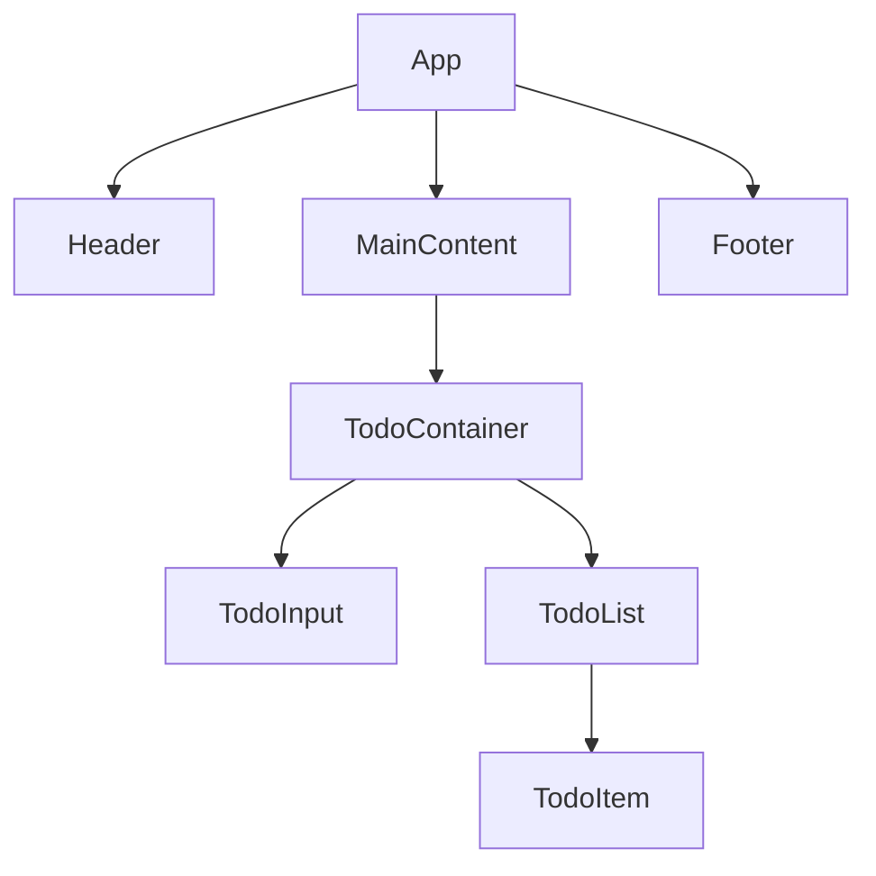

# Chapter 8: src/App.js - 메인 애플리케이션 컴포넌트

## 📚 학습 목표
- App 컴포넌트의 역할과 설계 원칙 이해
- 최상위 컴포넌트의 책임과 구조 파악
- 컴포넌트 구성과 데이터 흐름 설계
- 실제 Todo 프로젝트의 App.js 분석

## 🔗 필요한 사전 지식
- Chapter 4: React 기초
- Chapter 7: src/index.js
- React 컴포넌트와 JSX

---

## 1. App 컴포넌트의 역할

**App.js**는 React 애플리케이션의 **메인 컴포넌트**로, 전체 앱의 구조와 레이아웃을 담당합니다.

### 1.1 주요 책임
- **전체 레이아웃**: 앱의 기본 구조와 배치
- **라우팅 관리**: 페이지 간 네비게이션 (필요시)
- **전역 상태**: 여러 컴포넌트가 공유하는 데이터
- **컴포넌트 조합**: 하위 컴포넌트들의 조합과 배치

---

## 2. 우리 프로젝트의 App.js 분석

```javascript
import './App.css';
import TodoContainer from './components/TodoContainer';

function App() {
  return (
    <div className="App">
      <TodoContainer />
    </div>
  );
}

export default App;
```

### 2.1 단순함의 미학
우리 App 컴포넌트는 매우 간단합니다:
- **최소한의 책임**: TodoContainer에게 모든 로직 위임
- **명확한 구조**: 단일 컴포넌트를 감싸는 역할
- **확장 가능성**: 필요시 헤더, 푸터, 사이드바 추가 가능

---

## 3. App 컴포넌트 설계 원칙

### 3.1 단일 책임 원칙 (Single Responsibility)
```javascript
// 좋은 예: 각 컴포넌트가 명확한 역할
function App() {
  return (
    <div className="App">
      <Header />          {/* 헤더 담당 */}
      <MainContent />     {/* 메인 콘텐츠 담당 */}
      <Footer />          {/* 푸터 담당 */}
    </div>
  );
}

// 나쁜 예: App에서 모든 것을 처리
function App() {
  const [todos, setTodos] = useState([]);
  const [user, setUser] = useState(null);
  const [theme, setTheme] = useState('light');
  // ... 너무 많은 책임
  
  return (
    <div>
      {/* 복잡한 JSX */}
    </div>
  );
}
```

### 3.2 컴포넌트 계층 구조


### 3.3 데이터 흐름과 상태 관리
```javascript
// 상태를 어디에 둘 것인가?
function App() {
  // 전역적으로 사용되는 상태는 App에서 관리
  const [user, setUser] = useState(null);
  const [theme, setTheme] = useState('light');
  
  return (
    <div className={`App theme-${theme}`}>
      <Header user={user} onThemeChange={setTheme} />
      <TodoContainer user={user} />
      <Footer />
    </div>
  );
}
```

---

## 4. 실제 App 컴포넌트 예시들

### 4.1 기본 구조
```javascript
import React from 'react';
import './App.css';
import TodoContainer from './components/TodoContainer';

function App() {
  return (
    <div className="App">
      <header className="App-header">
        <h1>📝 Todo App</h1>
        <p>효율적인 할 일 관리</p>
      </header>
      
      <main className="App-main">
        <TodoContainer />
      </main>
      
      <footer className="App-footer">
        <p>&copy; 2025 Todo App. All rights reserved.</p>
      </footer>
    </div>
  );
}

export default App;
```

### 4.2 상태를 포함한 구조
```javascript
import React, { useState, useEffect } from 'react';
import './App.css';
import Header from './components/Header';
import TodoContainer from './components/TodoContainer';
import ThemeProvider from './contexts/ThemeContext';

function App() {
  const [user, setUser] = useState(null);
  const [isLoading, setIsLoading] = useState(true);

  useEffect(() => {
    // 사용자 정보 로드
    const loadUser = async () => {
      try {
        const userData = await fetchUserData();
        setUser(userData);
      } catch (error) {
        console.error('사용자 로드 실패:', error);
      } finally {
        setIsLoading(false);
      }
    };

    loadUser();
  }, []);

  if (isLoading) {
    return (
      <div className="App loading">
        <div className="spinner">로딩 중...</div>
      </div>
    );
  }

  return (
    <ThemeProvider>
      <div className="App">
        <Header user={user} onLogin={setUser} />
        <main className="App-main">
          <TodoContainer user={user} />
        </main>
      </div>
    </ThemeProvider>
  );
}

export default App;
```

---

## 5. 컴포넌트 구성과 분리

### 5.1 컴포넌트 분리 기준
```javascript
// 분리 전: 모든 기능이 App에 있음
function App() {
  const [todos, setTodos] = useState([]);
  const [filter, setFilter] = useState('all');
  const [newTodo, setNewTodo] = useState('');

  const addTodo = (text) => {
    // 할 일 추가 로직
  };

  return (
    <div className="App">
      {/* 복잡한 JSX */}
    </div>
  );
}

// 분리 후: 기능별로 컴포넌트 분리
function App() {
  return (
    <div className="App">
      <TodoContainer />  {/* 모든 Todo 로직은 여기서 */}
    </div>
  );
}
```

### 5.2 Props Drilling 해결
```javascript
// 문제: Props Drilling
function App() {
  const [user, setUser] = useState(null);
  
  return (
    <div className="App">
      <TodoContainer user={user} />
    </div>
  );
}

function TodoContainer({ user }) {
  return (
    <div>
      <TodoInput user={user} />
      <TodoList user={user} />
    </div>
  );
}

// 해결: Context 사용
import { UserProvider } from './contexts/UserContext';

function App() {
  return (
    <UserProvider>
      <div className="App">
        <TodoContainer />
      </div>
    </UserProvider>
  );
}
```

---

## 6. CSS와 스타일링

### 6.1 App.css 구조
```css
/* App.css */
.App {
  text-align: center;
  min-height: 100vh;
  display: flex;
  flex-direction: column;
}

.App-header {
  background-color: #282c34;
  padding: 20px;
  color: white;
}

.App-main {
  flex: 1;
  display: flex;
  flex-direction: column;
  align-items: center;
  justify-content: center;
  padding: 20px;
}

.App-footer {
  background-color: #f8f9fa;
  padding: 10px;
  color: #666;
  font-size: 0.9rem;
}

/* 로딩 상태 */
.App.loading {
  display: flex;
  align-items: center;
  justify-content: center;
}

.spinner {
  border: 4px solid #f3f3f3;
  border-top: 4px solid #3498db;
  border-radius: 50%;
  width: 40px;
  height: 40px;
  animation: spin 2s linear infinite;
}

@keyframes spin {
  0% { transform: rotate(0deg); }
  100% { transform: rotate(360deg); }
}

/* 반응형 디자인 */
@media (max-width: 768px) {
  .App-main {
    padding: 10px;
  }
  
  .App-header h1 {
    font-size: 1.5rem;
  }
}
```

### 6.2 테마 시스템
```css
/* 테마별 CSS 변수 */
.App.theme-light {
  --bg-primary: #ffffff;
  --bg-secondary: #f8f9fa;
  --text-primary: #212529;
  --text-secondary: #6c757d;
  --border-color: #dee2e6;
}

.App.theme-dark {
  --bg-primary: #212529;
  --bg-secondary: #343a40;
  --text-primary: #ffffff;
  --text-secondary: #adb5bd;
  --border-color: #495057;
}

.App {
  background-color: var(--bg-primary);
  color: var(--text-primary);
  transition: background-color 0.3s ease, color 0.3s ease;
}
```

---

## 7. 에러 처리와 로딩 상태

### 7.1 에러 바운더리와 함께 사용
```javascript
import React, { useState, useEffect } from 'react';
import ErrorBoundary from './components/ErrorBoundary';
import LoadingSpinner from './components/LoadingSpinner';
import TodoContainer from './components/TodoContainer';

function App() {
  const [isLoading, setIsLoading] = useState(true);
  const [error, setError] = useState(null);

  useEffect(() => {
    const initializeApp = async () => {
      try {
        // 앱 초기화 로직
        await new Promise(resolve => setTimeout(resolve, 1000));
        setIsLoading(false);
      } catch (err) {
        setError(err);
        setIsLoading(false);
      }
    };

    initializeApp();
  }, []);

  if (error) {
    return (
      <div className="App error-state">
        <h1>❌ 오류가 발생했습니다</h1>
        <p>{error.message}</p>
        <button onClick={() => window.location.reload()}>
          다시 시도
        </button>
      </div>
    );
  }

  if (isLoading) {
    return (
      <div className="App loading-state">
        <LoadingSpinner />
        <p>앱을 초기화하는 중...</p>
      </div>
    );
  }

  return (
    <ErrorBoundary>
      <div className="App">
        <TodoContainer />
      </div>
    </ErrorBoundary>
  );
}

export default App;
```

---

## 8. 라우팅이 있는 App 컴포넌트

### 8.1 React Router 사용
```javascript
import React from 'react';
import { BrowserRouter as Router, Routes, Route } from 'react-router-dom';
import './App.css';

import Header from './components/Header';
import Home from './pages/Home';
import TodoPage from './pages/TodoPage';
import About from './pages/About';
import NotFound from './pages/NotFound';

function App() {
  return (
    <Router>
      <div className="App">
        <Header />
        <main className="App-main">
          <Routes>
            <Route path="/" element={<Home />} />
            <Route path="/todos" element={<TodoPage />} />
            <Route path="/about" element={<About />} />
            <Route path="*" element={<NotFound />} />
          </Routes>
        </main>
      </div>
    </Router>
  );
}

export default App;
```

---

## 9. 실습: App 컴포넌트 확장

### 9.1 기능이 풍부한 App 컴포넌트
```javascript
import React, { useState, useEffect } from 'react';
import './App.css';

// 컴포넌트 imports
import Header from './components/Header';
import TodoContainer from './components/TodoContainer';
import Footer from './components/Footer';
import ThemeToggle from './components/ThemeToggle';
import NotificationContainer from './components/NotificationContainer';

// Context imports
import { ThemeProvider } from './contexts/ThemeContext';
import { NotificationProvider } from './contexts/NotificationContext';

// 커스텀 훅
import { useLocalStorage } from './hooks/useLocalStorage';

function App() {
  // 전역 상태 관리
  const [theme, setTheme] = useLocalStorage('theme', 'light');
  const [user, setUser] = useState(null);
  const [isLoading, setIsLoading] = useState(true);

  // 앱 초기화
  useEffect(() => {
    const initializeApp = async () => {
      try {
        // 저장된 사용자 정보 로드
        const savedUser = localStorage.getItem('user');
        if (savedUser) {
          setUser(JSON.parse(savedUser));
        }

        // 테마 적용
        document.documentElement.setAttribute('data-theme', theme);
        
        setIsLoading(false);
      } catch (error) {
        console.error('앱 초기화 실패:', error);
        setIsLoading(false);
      }
    };

    initializeApp();
  }, [theme]);

  // 테마 변경 핸들러
  const handleThemeChange = (newTheme) => {
    setTheme(newTheme);
    document.documentElement.setAttribute('data-theme', newTheme);
  };

  // 로딩 상태
  if (isLoading) {
    return (
      <div className="App loading">
        <div className="loading-content">
          <div className="spinner"></div>
          <h2>📝 Todo App</h2>
          <p>앱을 로딩 중입니다...</p>
        </div>
      </div>
    );
  }

  return (
    <ThemeProvider value={{ theme, setTheme: handleThemeChange }}>
      <NotificationProvider>
        <div className={`App theme-${theme}`}>
          <Header user={user} onUserChange={setUser} />
          
          <main className="App-main">
            <div className="App-container">
              <TodoContainer user={user} />
            </div>
          </main>
          
          <Footer />
          
          {/* 플로팅 액션 버튼들 */}
          <div className="floating-actions">
            <ThemeToggle 
              theme={theme} 
              onThemeChange={handleThemeChange} 
            />
          </div>
          
          {/* 알림 시스템 */}
          <NotificationContainer />
        </div>
      </NotificationProvider>
    </ThemeProvider>
  );
}

export default App;
```

---

## 10. 확인 문제

### 문제 1: 컴포넌트 설계
App 컴포넌트에서 관리해야 할 상태와 하위 컴포넌트에서 관리해야 할 상태를 구분하는 기준을 설명하세요.

### 문제 2: Props vs Context
언제 props를 사용하고 언제 Context를 사용해야 하는지 예시와 함께 설명하세요.

### 문제 3: 성능 최적화
App 컴포넌트에서 적용할 수 있는 성능 최적화 방법들을 나열하세요.

---

## 11. 다음 챕터 예고

**Chapter 9: TodoContainer.js - 컨테이너 컴포넌트**에서는:
- 컨테이너 컴포넌트의 역할과 설계 패턴
- 상태 관리와 비즈니스 로직 구현
- 하위 컴포넌트들과의 데이터 전달
- 실제 Todo 로직의 구현과 최적화

App의 전체 구조를 이해했다면, 이제 핵심 비즈니스 로직을 담당하는 컨테이너 컴포넌트를 살펴보겠습니다!

---

## 📝 핵심 요약

1. **App 컴포넌트는 애플리케이션의 전체 구조 담당**
2. **단일 책임 원칙에 따라 적절히 분리**
3. **전역 상태는 App에서, 지역 상태는 하위 컴포넌트에서**
4. **에러 처리와 로딩 상태 관리 중요**
5. **확장 가능한 구조로 설계**

다음 챕터에서 Todo 앱의 핵심 로직을 담당하는 컨테이너 컴포넌트를 학습하겠습니다!
